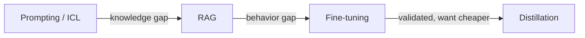

# Adaptation strategy — decision axes

## The decision axes

Instead of arguing about approaches in the abstract, decide by the **axis** that actually matters for
your problem:

- **Freshness** — how current must the knowledge be? If it changes often and must stay up to date,
  favor **RAG**: you update the index, not the weights. Baking volatile facts into weights means
  retraining forever and still serving stale answers.
- **Behavior change** — must the model adopt a persistent style or strict format that prompting can't
  reliably enforce? That's a job for **fine-tuning**, which bakes behavior into the weights.
- **Attribution** — must every answer point back to its exact source? Favor **RAG**, because retrieved
  chunks carry citable source metadata. Weights blend everything together and can't cite a source.

## Cost, latency, and sequencing

The remaining axes are about what you pay and when:

- **Cost** — **fine-tuning** front-loads a training cost, then serves cheaply. **RAG** avoids training
  but pays retrieval plus a larger context on every query. **Distillation** spends up front to cut
  ongoing deployment cost.
- **Latency** — RAG adds retrieval time and longer prompts per request; fine-tuning and distillation
  keep the prompt short. Distillation specifically targets lower per-token latency with a smaller model.

Put together, these axes imply a **default sequence**: try prompting / in-context learning first, add
**RAG** when the gap is *knowledge*, and reserve **fine-tuning** for *behavior* the lighter methods
can't deliver — then **distillation** once that behavior is validated and you want it cheaper. Reach
for the heaviest tool last, not first.

