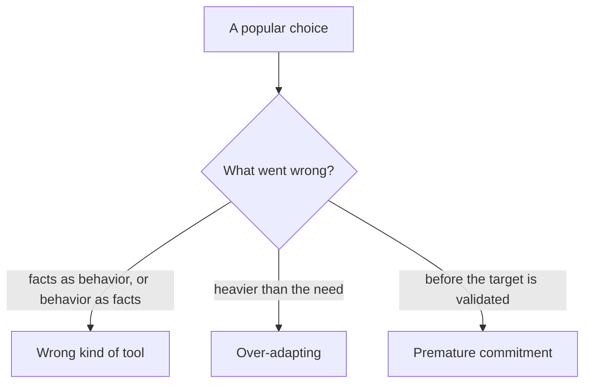

# Adaptation strategy selection — antipatterns roadmap

## Roadmap: antipatterns and the wrong tool

**What this section covers.** The senior signal isn't naming the right tool — it's spotting when a *popular* choice is the wrong one, whether from a knowledge/behavior mix-up or from committing to a heavy lever too soon.

**The ideas you'll meet:**

- **Fine-tuning for volatile facts** — the canonical wrong tool; freshness is a *retrieval* problem, so use RAG.
- **RAG to fix formatting** — retrieval supplies knowledge, not behavior; formatting is a prompting or fine-tuning job.
- **Over-adapting** — investing in a heavier method when a lighter one already meets the requirement.
- **Premature fine-tuning** — training before you have a stable, validated target behavior.
- **Premature distillation** — mass-producing an unvalidated behavior; the student faithfully copies the teacher's flaws too.

**Why it matters.** Naming the wrong tool for a scenario is the fastest way to read as senior — and to avoid a design that passes a demo and then quietly degrades in production.
