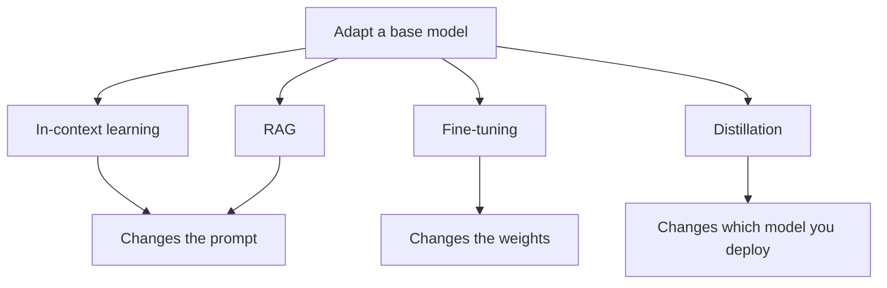

# Adaptation strategy selection — approaches roadmap

## Roadmap: the four adaptation approaches

**What this section covers.** Adapting a base model to your task is a choice among four levers — in-context learning, RAG, fine-tuning, and distillation — and the whole game is knowing that each one changes a *different* thing.

**The ideas you'll meet:**

- **In-context learning (ICL)** — steer the model at inference time with instructions and few-shot examples; nothing permanent changes, and it is the cheapest, fastest-to-iterate lever.
- **RAG** — fetch relevant documents at query time to add *knowledge* (fresh, private, citable) without touching the weights.
- **Fine-tuning (SFT, LoRA/PEFT)** — update the weights to durably change *behavior*: format, style, tone, task reliability.
- **Distillation** — train a smaller *student* to reproduce a larger *teacher's* known-good behavior, cutting deployment cost and latency.
- **Knowledge vs. behavior** — the core split: RAG changes what the model can *see*; fine-tuning changes how it *acts*.

**Why it matters.** Confusing knowledge with behavior is the root of most bad adaptation decisions — this four-lever framing is the foundation every later choice in the topic rests on.
