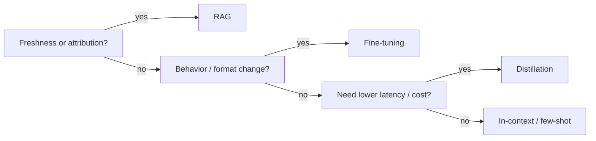

# Adaptation strategy selection — decision roadmap

## Roadmap: choosing by decision axis

**What this section covers.** How to pick a lever by the *axis* that actually matters — freshness, behavior change, attribution, cost, latency — then turn those axes into an ordered decision function and use the same checklist to review someone else's design.

**The ideas you'll meet:**

- **Freshness** — how current the knowledge must be; volatile facts favor RAG because you update the index, not the weights.
- **Behavior change** — a persistent style or strict format prompting can't reliably enforce; that's a job for fine-tuning.
- **Attribution** — every answer must point back to its exact source; favor RAG, whose retrieved chunks carry citable metadata.
- **Cost & latency** — fine-tuning front-loads training then serves cheap; RAG pays retrieval plus a larger context on every query.
- **The escalation ladder** — the default sequence prompt → RAG → fine-tune → distill; reach for the heaviest tool last, not first.
- **The decision function** — encoding the axes as ordered precedence checks so the right lever falls out deterministically.
- **Reviewing a design** — a checklist that rates an adaptation design toy → prototype → demo-ready → production-ready.

**Why it matters.** Choosing by axis instead of by fashion — and being able to critique a design the same way — is exactly the judgment interviewers and staff-engineer design reviews probe for.
