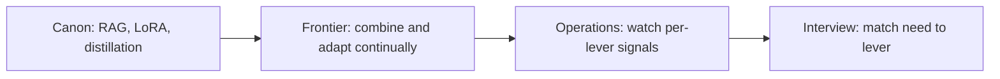

# Adaptation strategy selection — frontier roadmap

## Roadmap: frontier, operations, and interview

**What this section covers.** The expert layer — the canonical papers behind each lever, the open research frontier, the operational signals you watch once a strategy is live, and how all of it shows up in an interview.

**The ideas you'll meet:**

- **The canon** — RAG (Lewis et al., 2020), LoRA/PEFT (Hu et al., 2021), and knowledge distillation (Hinton et al., 2015).
- **Hybrid** — the SOTA design: RAG for volatile facts, PEFT for durable behavior, distillation for cheap serving.
- **Continual / online adaptation** — keeping a deployed system correct as data drifts, without a full retraining run every cycle.
- **Principled method combination** — choosing each lever by requirement, knowing every added lever multiplies the eval surface.
- **Operational signals** — per-strategy quality, cost, and latency, plus staleness, index freshness, and retrain cadence.
- **Interview judgment** — name the wrong tool, defend a combination, and lead with the decision axes.

**Why it matters.** Knowing the canon and running adaptation under drift — plus naming what each method is *not* for — is what separates someone who knows the levers from someone who can operate them.
