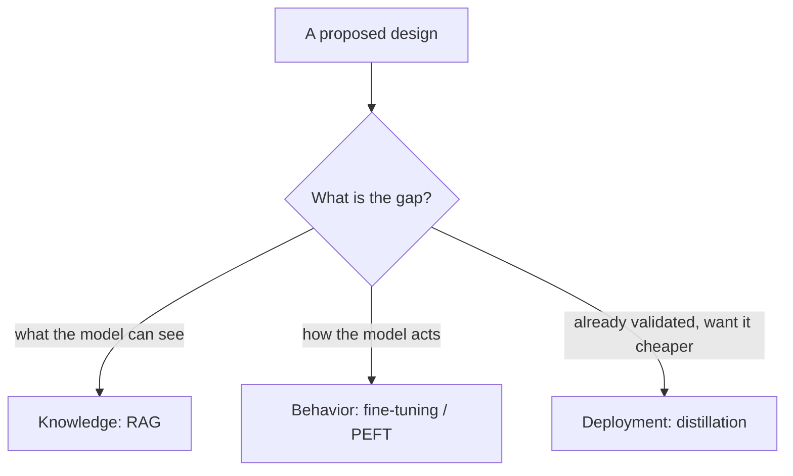

## Reviewing an adaptation design

**In brief.** Every adaptation decision is really a decision about **where a capability lives** — in the
prompt, in a retrieval index, in the weights, or in which model you deploy. Reviewing one — in a design
doc or an interview — means classifying the requirement correctly at the root, then checking that
nothing heavy was committed to before the target was validated.

**The review checklist.**

- **Knowledge or behavior?** The root classification. Is the requirement about what the model **knows**
  (goes to RAG) or how it **acts** (goes to fine-tuning)? A design that answers a behavior problem with
  retrieval, or a knowledge problem with training, is misclassified at the root — and no amount of tuning
  downstream repairs it. You cannot retrieve your way to a new behavior, and you cannot fine-tune your
  way to always-current facts.
- **Is anything volatile being baked into weights?** The canonical wrong tool, and the fastest red flag
  to name. Prices, inventory, this week's policy — baked into weights, they go stale the moment training
  finishes, and every update demands another training run. Retraining more often does not fix it; the
  mechanism is wrong. Freshness is a **retrieval** problem, so move that content to RAG, which updates
  the index without retraining and can cite the source.
- **Did they start light?** Was prompting / in-context learning, then RAG, exhausted before committing to
  training? Jumping straight to fine-tuning or distillation is over-adapting (paying cost and rigidity
  for what a lighter lever already met) or premature commitment.
- **Is the target validated before it's frozen?** Fine-tuning before behavior is stable locks in a slow
  data-collection-plus-retraining loop before you know what "good" looks like. Distillation is worse: the
  student faithfully reproduces the teacher — flaws included — so distilling an unvalidated teacher just
  builds a cheaper way to be wrong. Validate first, then freeze; validate first, then distill.
- **What's the eval and freshness story?** A real design names the eval gate for each lever and how the
  index stays current — never "it just works."

**Rating the design.**

- **Toy** — picks one lever by fashion.
- **Prototype** — matches lever to need.
- **Demo-ready** — sequences the levers lightest-first.
- **Production-ready** — also validates behavior before freezing it, keeps volatile facts in retrieval,
  and gates each lever behind its own eval.

**Why it matters.** These checks place any adaptation design on the toy → production ladder in minutes,
and they name the red flags that sink a candidate: fine-tuning for changing facts, reaching for retrieval
to fix a format or style failure, and freezing or distilling a behavior nobody has validated.
