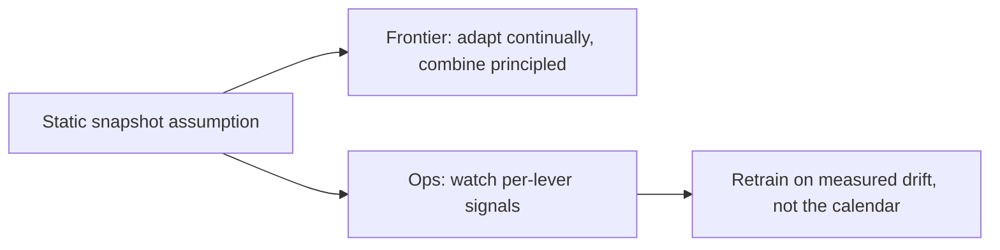

## The frontier & operating adaptation live

**In brief.** The research edge and the production dashboard attack the same weakness from two sides: the
classic levers all assume a **static snapshot** and a single monolithic choice. You fine-tune on today's
data, distill today's teacher, index today's documents — and then the world moves.

**Where the frontier is.**

- **Continual and online adaptation as data drifts.** The two drifts are not equally hard. **Fact drift is
  already cheap**: RAG updates the external index independently of the weights, which is exactly why it is
  the default lever for volatile knowledge. **Behavior drift is the harder open case** — new formats, new
  tasks, a shifting distribution the fine-tune no longer covers — because re-fine-tuning is a
  data-collection-plus-training loop and a distilled student is frozen at distill time. The open work is
  adapting the weight-based levers incrementally rather than periodically freezing another snapshot.
- **Principled method combination (RAG + PEFT + distillation).** The SOTA design is a pipeline, not one
  lever: RAG for fresh citable knowledge, PEFT/LoRA for durable behavior, distillation to serve it
  cheaply — each layer chosen because a specific need demands it, and each gated by its own eval. The
  load-bearing caution: **every added lever multiplies the eval surface.** RAG + PEFT means two
  independent places quality can silently regress — a retrieval miss and a behavior regression look
  different and need different evals. The cost of the SOTA design is **operational**, not just compute.
- **When to fine-tune vs. keep using prompt or RAG.** The escalation ladder (prompt → RAG → fine-tune →
  distill) is guidance, not a formula. The crossover is set by the scenario's requirements — is the gap
  knowledge or behavior, how volatile, does it need attribution, what volume — and both directions of
  error cost you: fine-tune too early and you freeze effort into weights before the target is validated;
  too late and you pay a token tax on every call for behavior a small adapter would have made durable.
  The frontier is making that call defensible from requirements instead of by habit.

**Signals to watch in production.**

- **Per-strategy quality, cost, and latency, tracked separately.** A hybrid has more than one lever, so a
  single end-to-end number hides which one moved. Track retrieval quality (did the right documents come
  back?) apart from generation and behavior quality; track RAG's per-query token cost and retrieval
  latency apart from the fine-tuned model's short-prompt serving cost. The split is what **localizes** a
  regression — a retrieval miss and a behavior regression need different fixes.
- **Staleness of fine-tuned and distilled knowledge.** Anything baked into weights was correct at train
  time and drifts silently after — treat weight-frozen knowledge as **perishable**. A rising rate of
  stale-fact errors is the signal to move that knowledge into retrieval, not to retrain again.
- **Retrieval freshness (index age / TTL).** RAG is only as current as its index. A retrieval layer
  silently serving month-old documents recreates the staleness problem RAG was supposed to solve; index
  age and reindex lag are the leading indicators.
- **Re-train and re-distill cadence.** Retraining should be driven by **measured drift**, not the
  calendar: rising behavior regression on the eval set, growing distance between production traffic and
  the training distribution, and the staleness rate. A fixed schedule wastes compute when nothing drifted
  and is too slow when something did.

**Why it matters.** Evaluate every lever on its own axis, treat weight-frozen knowledge as perishable,
keep the index fresh, and let measured drift trigger the next retrain — that is the difference between
knowing the levers and operating them.
