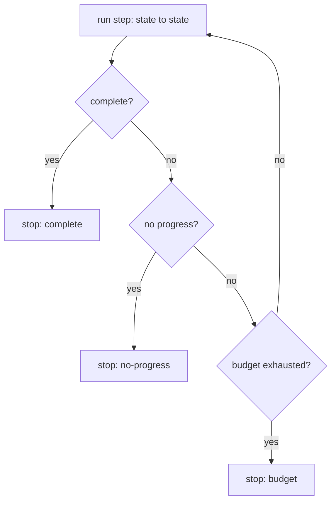

# Build it: a bounded agent loop

## The loop and its three stop conditions

An agent loop repeatedly steps from one state to the next. The single most important property is that
it **always stops** — an unbounded loop with tool access is a runaway waiting to happen. Every
production agent loop needs **three** stop conditions, and dropping any one is a bug:

1. **Complete** — the step reports the task is done. The happy path.
2. **Budget** — a hard cap (max steps, and in real systems also tokens / tool calls / wall-clock /
   cost). This is the backstop that guarantees termination even if nothing else fires.
3. **No-progress** — the agent is stuck repeating itself. Stop early rather than burn the whole budget.

A loop with only "complete" runs forever on a task it can't finish; a loop with only "budget" wastes
the entire budget spinning. You need all three.

## Detecting no progress

The simplest, most useful no-progress signal: **the step produced the same state it was handed**. If
applying a step doesn't change anything, the agent is oscillating or stuck, and continuing will just
repeat. Detect it by comparing the new state to the previous one; if they're equal, stop.

Two design details that matter:

- **Order the checks:** after each step, check *complete* first (don't penalize a step that finished),
  then *no-progress*, then *budget*.
- **Return the reason.** Don't just stop — return *why* (`complete` / `budget` / `no-progress`) so the
  caller can react: surface a partial result, escalate to a human, or report the runaway. A stop
  without a reason is nearly as bad as no stop at all.
