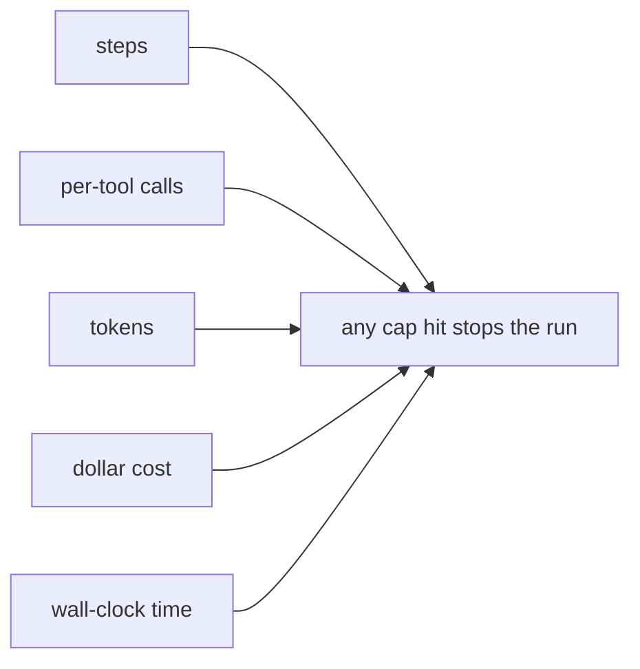

# Agent guardrails & budgets — budgets roadmap

## Roadmap: agent budgets

**What this section covers.** A budget is not one number but a set of independent caps, each bounding
a different way a stuck agent can burn resources. This section covers the five budget dimensions, why
wall-clock time needs its own cap, and how a run should degrade when a cap trips.

**The ideas you'll meet:**

- **Budget dimensions** — steps, per-tool calls, tokens, cost, and wall-clock time; any one being hit ends the run.
- **Step / iteration cap** — the coarsest and most important bound on loop turns.
- **Per-tool cap** — stops one expensive or rate-limited tool from being hammered even while the step budget has room.
- **Cost ceiling** — the dollar total that protects the bill directly; its absence is the runaway-bill antipattern.
- **Wall-clock timeout** — the only cap that bounds latency when a single step hangs.
- **Graceful degradation** — returning partial work plus a clear "stopped: budget exhausted" instead of crashing.

**Why it matters.** Each dimension bounds a distinct failure mode, so capping one axis and calling it
done is exactly where runaway cost and hung runs slip through.
