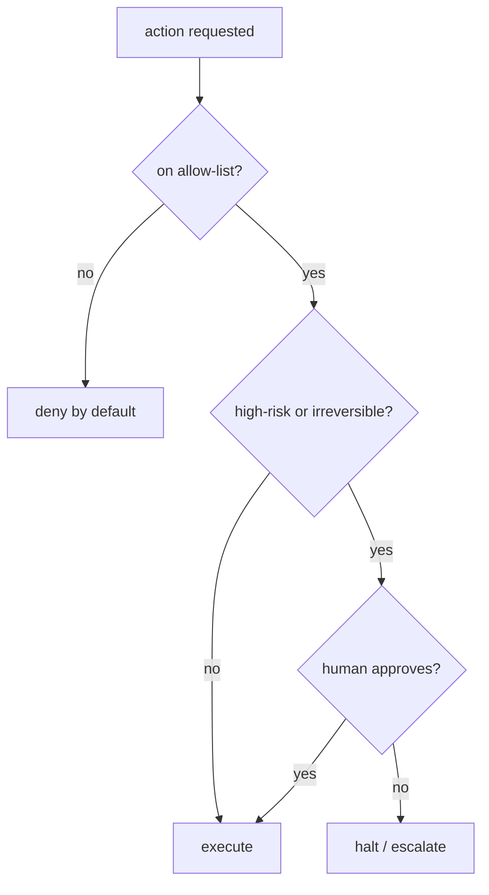

# Agent guardrails & budgets — guardrails roadmap

## Roadmap: guardrails for high-risk actions

**What this section covers.** Budgets bound *how much* an agent does; guardrails bound *what* it is
allowed to do. This section covers deny-by-default allow-lists, the gates that sit in front of
high-risk or irreversible actions, and the autonomy-versus-safety tradeoff.

**The ideas you'll meet:**

- **Allow-list (deny-by-default)** — only explicitly approved actions run; everything else is denied.
- **Deny-list** — enumerates bad actions and permits the rest, so it fails open on anything nobody forbade.
- **HITL confirmation** — a human-in-the-loop gate that requires approval *before* a high-risk action executes.
- **Escalation** — handing control to a human when the agent is uncertain or a risk threshold is crossed.
- **Circuit breaker** — trips and halts the run when a failure or risk signal crosses a threshold.
- **Blast radius** — the potential damage of an action, which sets how strict its gate should be.

**Why it matters.** An allow-list fails safe while a deny-list fails open, and gating by blast radius
is what lets read-only lookups run freely while destructive actions still earn a confirmation.
