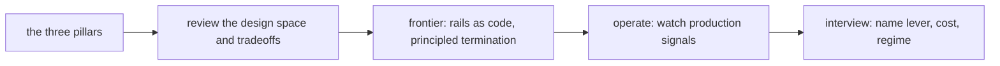

# Agent guardrails & budgets — synthesis roadmap

## Roadmap: design review, frontier and interview

**What this section covers.** With the three pillars in hand — termination, budgets, and guardrails —
this section zooms out to the design space and its tradeoffs, how to review a runner the way an
interviewer would, the research frontier, and the signals you watch once it is live.

**The ideas you'll meet:**

- **Design space (five levers)** — budget dimensions, termination conditions, no-progress detection, action gating, failure containment.
- **Common, SOTA, antipattern** — the ladder for placing any runner design on a maturity scale.
- **Toy / prototype / demo / production-ready** — the rating scale for how many exit and guardrail questions a design answers.
- **ReAct / Reflexion** — the reason-then-act loop, and self-reflection retry, that budgets and termination must bound.
- **Building Effective Agents** — Anthropic's guidance for simple, well-bounded, verified autonomy.
- **NeMo Guardrails / Guardrails AI** — named frameworks that make guardrails a reviewable, versioned spec (rails as code).
- **Production signals** — steps-per-task distribution, budget-exhaustion rate, loop-detection trigger rate, graceful-degradation rate.

**Why it matters.** Naming each lever with what it costs and the regime where it wins — and which
signal tells you it fired — is what separates a senior answer from "just add a max-steps cap."
