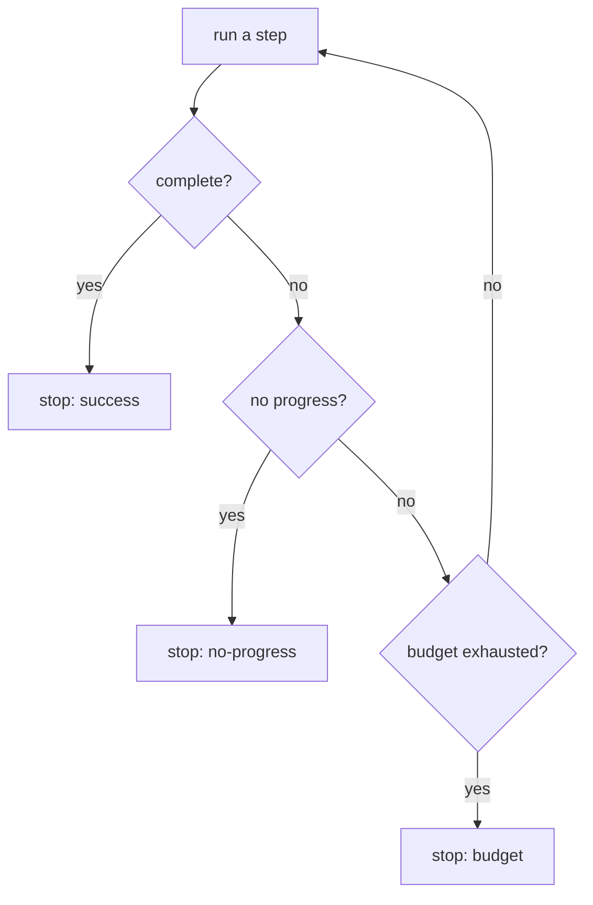

# Agent guardrails & budgets — termination roadmap

## Roadmap: termination and progress detection

**What this section covers.** An agent runs a loop that chooses its own next action and has no
natural stopping point, so the runner has to decide *when* to stop. This section covers the
termination conditions a loop needs and how to detect that it has stopped making progress before a
budget drains.

**The ideas you'll meet:**

- **Termination conditions** — the explicit rules for when the loop stops: success, detected failure / no-progress, or budget exhaustion.
- **Success-only exit** — the antipattern of stopping only when the task is solved; an unreachable goal then loops forever.
- **No-progress detection** — noticing the agent is stuck by watching for repeated actions or revisited states (oscillation).
- **Graceful termination** — stopping cleanly by returning the best partial result and the agent's state instead of crashing.
- **Stop reason** — returning *why* the loop stopped (complete / budget / no-progress) so the caller can react.

**Why it matters.** A loop that can only stop on success is one unreachable goal away from running
forever; naming every exit and catching "stuck" early is what turns an open-ended agent into a
bounded, resumable one.
