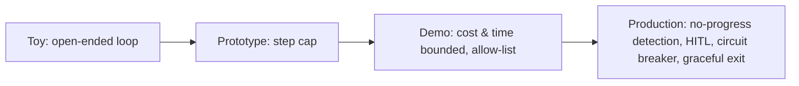

## Reviewing a guardrails-and-budgets design

**In brief.** Every decision here is really about how much unsupervised autonomy you grant a loop that
chooses its own next action, and what stops it when things go wrong. Reviewing one — in a design doc
or an interview — means walking five levers and refusing to let one cap stand in for the others: a
step count is not a proxy for time, for dollars, or for "the agent is stuck."

**The five levers.**

- **Budget dimensions** — cap steps and iterations, per-tool call counts, cumulative tokens, dollar cost, and wall-clock time. These are not redundant. Step and token caps do not bound how long a single hung tool call takes, so wall-clock is a separate guard; a global step cap does not stop one expensive or rate-limited tool from being hammered while total usage stays under the cap, so per-tool counts are separate again. Budgeting on one axis and calling it done is exactly where runaway cost and hung runs slip through — each axis bounds a different failure mode.
- **Termination conditions** — exit on success, on detected failure or no-progress, and on any budget exhaustion. A success-only exit is the classic antipattern: a goal the agent can never reach means an open-ended loop, and pairing it with a step cap only means a stuck run drains the whole budget before stopping.
- **No-progress detection** — the signal that separates working from stuck. Repeated actions or revisited states with no change to the environment (oscillation) mean stop, rather than waiting for a budget to drain. Catching an oscillation at step 3 avoids paying out the remaining step, token, and dollar budget. Detection is heuristic, so the design question is the false-positive rate, not whether to have it.
- **Action gating** — an allow-list (deny-by-default) for which tools can run at all, plus human-in-the-loop confirmation before high-risk or irreversible actions execute. An allow-list fails safe; a deny-list fails open on the first risky action nobody thought to forbid. Logging a destructive action after it runs is auditing, not prevention — the harm is already done.
- **Failure containment** — circuit breakers and escalation paths that halt the run and hand control to a human when an error or risk signal crosses a threshold, plus graceful termination that returns the best partial result and inspectable state instead of crashing.

**The review checklist.**

- What are the exit conditions? If the only exit is "stop when solved," stop there.
- Which budget dimensions are capped? Missing wall-clock (hung steps), missing per-tool (hammered tools), or missing a dollar ceiling (runaway cost) are each an immediate flag.
- Is there no-progress detection, or does the runner wait for a budget to drain instead of catching stuck early?
- Allow-list or deny-list, and are high-risk actions gated before they execute?
- What happens at the boundary — a named circuit breaker and escalation path, and a partial result returned on exhaustion, rather than "it just crashes" or "it just works"?

**The maturity ladder.** A **toy** has an open-ended loop. A **prototype** adds a step cap. A **demo**
bounds cost and time and uses an allow-list. A **production-ready** design also detects no-progress,
gates high-risk actions behind HITL, has a circuit breaker with an escalation path, and terminates
gracefully with inspectable state. Rating any design is just counting how many checklist questions it
answers.

**What reads as senior.**

- **Enumerating the full set of exits** — not just "stop on success," but detected failure and no-progress plus every budget-exhaustion exit (steps, tools, tokens, cost, wall-clock). Naming success-only as the antipattern is the fastest positive signal.
- **Why budgets matter even for a correct agent** — an agent that usually succeeds can still loop, hang on a slow tool, or blow a cost ceiling on the one hard task. Limits are not only for buggy agents.
- **Naming the cost of each lever** — the answer in miniature is: name the lever, name what it costs, name the regime where it wins. "Just add a max-steps cap," with no mention of wall-clock, cost, and no-progress as separate guards, signals shallow depth.

**Why it matters.** These five levers place any runner on the toy → prototype → demo →
production ladder in minutes, and they name the red flags that sink a design review: an open-ended
loop with no cost ceiling, a success-only exit, a deny-list that fails open, and a high-risk action
logged after it runs instead of confirmed before.
