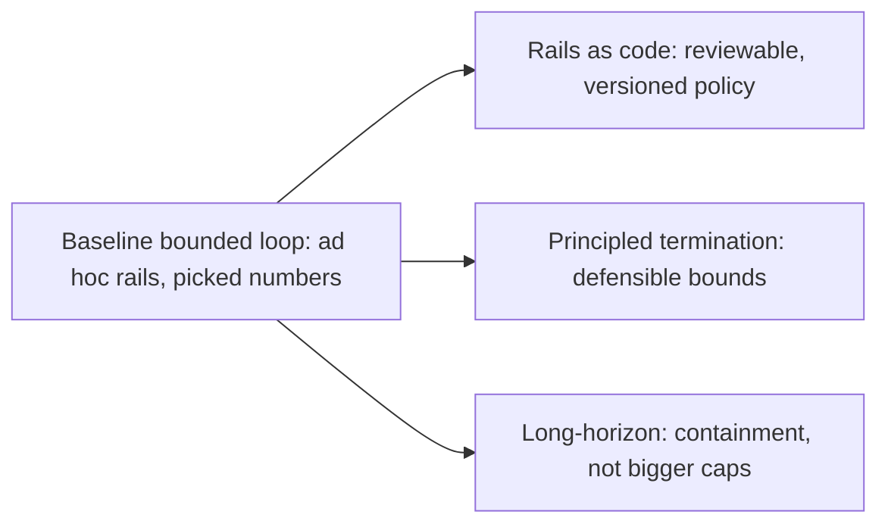

## The frontier & operating a live runner

**In brief.** Both research directions attack the same weakness of the baseline bounded loop: its
guardrails and its budgets are **ad hoc**. One makes the what-is-allowed boundary a reviewable spec;
the other tries to make the when-it-stops boundary a defensible bound. Once the runner is live you do
not watch "guardrails" — you watch four signals that say where the next failure is forming.

**Where the frontier is.**

- **Named enforcement frameworks — rails as code.** Instead of hand-rolling an allow-list inside each runner, the frontier ships guardrails as declarable, reusable policy. **NeMo Guardrails (NVIDIA)** makes programmable rails around an agent a first-class artifact: you define the allowed flows and deny-by-default boundaries rather than scattering `if` checks through the loop. **Guardrails AI** frames the same problem on the content axis — validators and structured guards on inputs and outputs with a **validate → repair → gate** cycle. The load-bearing shift is that guardrails become **specifications you can review, version, and test**, letting a team reason about what an agent can do independently of what the loop happens to run. Note what this is not: rails constrain permitted actions, they do not prove the loop terminates and they do not remove the need for budgets. "We have guardrails" is a real claim only when you can point at the rail that would have stopped a given incident.
- **Principled termination — from picked numbers to defensible bounds.** Today's budgets are mostly hand-tuned ceilings ("we picked 20 steps") and no-progress detection is heuristic step-diffing. The research edge is moving toward **formal termination bounds** and **no-progress detection that generalizes across task types** rather than pattern-matching one loop's oscillation. Per canon, reliably detecting "stuck" and principled budgets are stated **open problems** — not solved knobs, and not a claim that agents never get stuck. The mental model: the field is trying to replace "we picked a number" with "here is the argument the loop must terminate."
- **Safe long-horizon autonomy.** Also a stated open problem. As runs lengthen, the concern shifts from bounding a short loop to staying safe across many steps, which calls for **containment — HITL escalation** — rather than merely larger caps. Multiplying every ceiling, dropping guardrails after a clean streak, or switching to a success-only exit so long tasks can finish all make long-horizon runs less safe, not more.

**Signals to watch in production.**

- **Steps-per-task, as a distribution not an average** — the headline gauge of loop health. A creeping tail (tasks that used to finish in 4 steps now taking 15) means the agent is working harder for the same outcome, often before any budget actually trips. The mean hides the runs that are about to become runaways.
- **Budget-exhaustion rate** — the fraction of runs that end because a budget (steps, tokens, cost, or wall-clock) drained rather than because the task completed. A rise at constant traffic means the backstop is doing its job but the agent is increasingly failing to finish inside its bounds — a symptom of harder tasks or a regression. Reflexively raising the cap just pays out more budget on runs that were going to fail; investigate why completion moved, alongside the steps-per-task distribution.
- **Loop and stuck-detection trigger rate** — how often no-progress or oscillation detection fires. This is the early-warning signal: catching stuck here means the run stopped before it drained the step, token, and dollar budget it would otherwise have paid out. A spike means something changed — a tool started returning no-ops, or a goal became unreachable.
- **Graceful-degradation rate** — the fraction of early-terminated runs that returned a usable partial result and inspectable state versus those that crashed or returned nothing. This is the operational form of terminating gracefully: a bounded loop that hits its budget and crashes has failed its users as surely as an unbounded one, just more cheaply. Two runners with the identical exhaustion rate can differ entirely on whether the boundary returns value.

**Why it matters.** Alert on **loop-detection triggers and budget-exhaustion rate** (the leading
indicators that the loop is getting harder or getting stuck), capacity-plan and cost-plan on the
**steps-per-task distribution**, and treat **graceful-degradation rate** as the SLO that says a hit
budget still returns value instead of a crash. Never reason about an agent's health in success rate
alone — a runner can hold its success rate steady while its steps-per-task tail and cost quietly climb.
