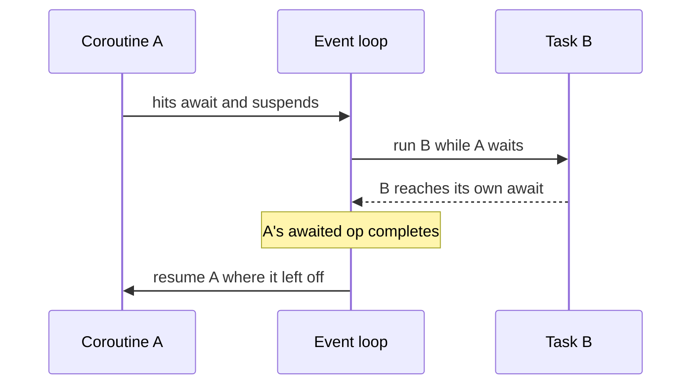

# Python & async foundations — async patterns

## await yields control

The two keywords that make async work are `async` and `await` (introduced in PEP 492). Writing
`async def` declares a **coroutine function**: calling it does not run the body, it returns a coroutine
object that only makes progress when it is awaited or scheduled on the event loop. `await` is the other
half — it is the **cooperative yield point**.

When a coroutine hits `await something()`, it suspends itself and returns control to the event loop. The
loop is then free to run any other ready task until the awaited operation completes, at which point this
coroutine resumes right where it left off. Crucially, `await` does not spin up a thread and does not
block the loop; it *volunteers* the CPU so other tasks can advance while this one waits.

```python
async def fetch_one(client, q):
    resp = await client.fetch(q)   # suspend here; loop runs other tasks meanwhile
    return resp
```



The flip side is that cooperation is a contract you can break. A blocking call — `time.sleep(5)`, a
synchronous DB driver, a heavy CPU loop — never reaches an `await`, so it never yields, and the *entire*
single-threaded loop freezes until it finishes. In async code you reach for the awaitable equivalent
(`await asyncio.sleep(5)`) or push the blocking work to an executor.

## Fan out with gather

One `await` runs one thing at a time. To get concurrency you need to have *several* awaitables in flight
before you await, and `asyncio.gather` is the standard way. You pass it the coroutine objects (do not
await them first — that would run them serially), and it schedules them all, waits for every one, and
returns results **positionally in input order**.

```python
async def gather_calls(client, queries):
    coros = [client.fetch(q) for q in queries]   # coroutine objects, not yet awaited
    return await asyncio.gather(*coros)           # all run concurrently; order preserved
```

The order guarantee matters: even though the calls finish in whatever order the network delivers them,
`gather` lines the results back up with the inputs, so `results[i]` always corresponds to `queries[i]`.
That lets you fan out a batch of model or tool calls and still zip the answers back to their requests
without bookkeeping. This is the concurrency primitive the resilient-call patterns in the next section
build on, and it mirrors the fan-out you'll see again in
[production-failure-modes](../../production-failure-modes/).
