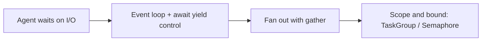

# Python & Async Foundations — async concurrency roadmap

## Roadmap: the event loop and async concurrency

**What this section covers.** Why an agent — which spends almost all its wall-clock time *waiting* on
models, APIs, and tools — should overlap those waits instead of paying for them in series, and the
`asyncio` vocabulary that makes the overlap safe and bounded.

**The ideas you'll meet:**

- **I/O-bound** — an agent step is mostly idle, parked on a network read; throughput is governed by how you manage *waiting*, not compute.
- **Event loop** — the single-threaded cooperative scheduler that advances whichever coroutine is ready.
- **Coroutine** — an `async def` function; calling it returns an object that only makes progress once awaited or scheduled.
- **`await`** — the cooperative yield point where a coroutine suspends and hands control back to the loop.
- **`asyncio.gather`** — fan many awaitables out at once and get results back positionally, in input order.
- **`create_task` / `TaskGroup`** — schedule work in the background; the TaskGroup scopes task lifetimes so one failure can't leak a runaway.
- **`Semaphore` / bounded concurrency** — cap how many calls run at once to apply backpressure instead of an unbounded flood.
- **`to_thread` / `as_completed`** — push blocking work off the loop, and stream results in completion order.
- **Concurrency vs. parallelism** — asyncio overlaps *waiting* on one thread (the GIL is irrelevant here); it does not speed up CPU-bound work.

**Why it matters.** This concurrency layer is the foundation every later section builds on — resilient
calls and error isolation are all patterns wrapped around the fan-out you learn here.
