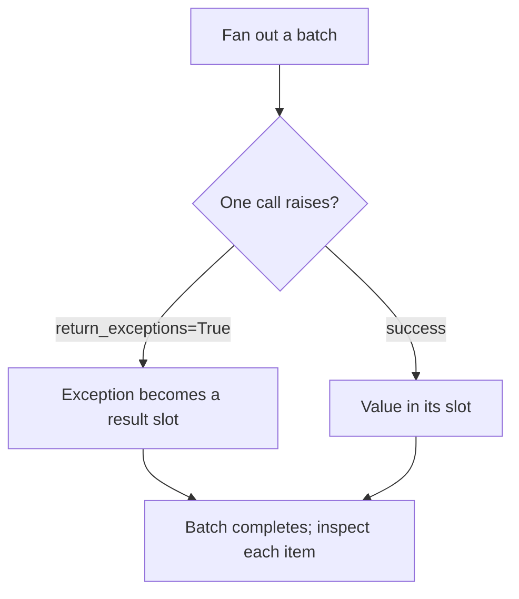

# Python & Async Foundations — error isolation roadmap

## Roadmap: isolating failures in a fan-out

**What this section covers.** Fanning work out creates a new failure mode: by default one raising call
sinks the whole batch. This section is the discipline that contains a failure so it becomes a data
point rather than a crash, letting the good results survive.

**The ideas you'll meet:**

- **Fan-out failure mode** — by default `asyncio.gather` propagates the *first* exception and discards every other result, even the successful ones.
- **`return_exceptions=True`** — `gather` returns the exception object in that slot instead of raising, so the batch always completes.
- **Per-unit `try`/`except`** — the hand-rolled equivalent: catch each task's error locally and turn it into a result.
- **Failure as a data point** — isolate each unit of work so one flaky call becomes an `{"ok": false, ...}` entry, not a group abort.

**Why it matters.** Timeouts and retries recover what they can; error isolation contains whatever still
fails — together they give an agent a fan-out that is fast, patient, and robust to any single call
going down.
