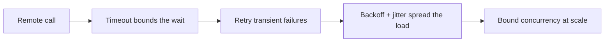

# Python & Async Foundations — resilient calls roadmap

## Roadmap: resilient remote calls

**What this section covers.** Every call an agent makes crosses a network to a service that will
eventually misbehave. Treat those failures as *expected input*: bound each wait, retry the transient
ones safely, and govern concurrency so retries don't become a self-inflicted outage.

**The ideas you'll meet:**

- **Timeout** — wrap an `await` so a hang becomes a normal, catchable error instead of a silent freeze.
- **Bounded retry** — retry transient failures, but give up after N attempts so a down service can't trap you forever.
- **Transient vs. permanent** — retry the noise (a `503`, a reset); don't retry a genuine, permanent error.
- **Exponential backoff** — grow the delay between attempts (1s, 2s, 4s…) so you back pressure off an overloaded service.
- **Jitter** — add randomness to each delay so many clients don't retry in lockstep and cause a **thundering herd**.
- **Backpressure / bounded concurrency** — a semaphore or worker pool caps in-flight calls so a fleet doesn't oversubscribe both ends.
- **Connection pooling** — share a bounded, pooled HTTP client instead of opening a fresh socket per request.
- **Rate-limit awareness** — expect `429`s, honor `Retry-After`, and ideally throttle proactively to stay under the quota.

**Why it matters.** Timeout, bounded exponential backoff, and jitter are the standard resilience trio
for any remote call — the difference between an agent that survives a flaky dependency and one that
crashes on the first `503`.
