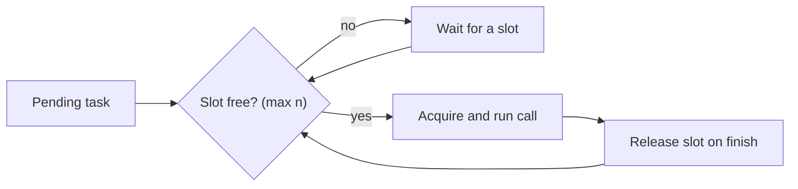

# Python & async foundations — structured & bounded concurrency

## Beyond gather tasks and structured concurrency

`asyncio.gather` is the workhorse fan-out, but it is not the only way to get several coroutines in
flight, and at scale it is not the safest. Recall that calling an `async def` function does **not** run
it — it returns a **coroutine object** that only makes progress once awaited or scheduled. `await coro`
runs that one coroutine to completion before continuing; to overlap work you need several coroutines
scheduled *before* you await. `asyncio.create_task(coro)` does exactly that: it hands the coroutine to
the event loop to run in the background and returns a `Task` handle you can await later.

```python
task_a = asyncio.create_task(fetch(a))   # scheduled now, running concurrently
task_b = asyncio.create_task(fetch(b))
ra, rb = await task_a, await task_b       # both were already overlapping
```

The danger with bare tasks (and with `gather`) is **leakage**: if one task raises, the others may keep
running unsupervised, and nothing scopes their lifetime to where you started them. `asyncio.TaskGroup`
(Python 3.11+) is the **structured concurrency** answer. Every task started inside the `async with`
block is awaited at block exit; if one fails, the group cancels its siblings and propagates the error,
so no task can outlive the block that owns it.

```python
async with asyncio.TaskGroup() as tg:
    tg.create_task(fetch(a))
    tg.create_task(fetch(b))
# on exit: all done, or the first failure cancelled the rest and raised
```

That makes "one failure should not leak a runaway task" a **structural property** of the code rather
than something you remember to handle — the same discipline the error-isolation lesson applies to
*results* now applied to *task lifetimes*.

## Bounding concurrency with a semaphore

Fan-out has a scale trap: `gather` (or a loop of `create_task`) launches **everything at once**. Fan a
thousand calls out and you open a thousand connections — enough to exhaust your HTTP connection pool,
trip the upstream's rate limit, and make timeouts cascade. The event loop does **not** auto-throttle;
it will happily oversubscribe both ends.

The primitive that fixes this is **bounded concurrency** via `asyncio.Semaphore(n)`. Acquire it inside
each task so at most `n` calls are in flight at once while the rest wait their turn — client-side
**backpressure** instead of an unbounded flood.

```python
sem = asyncio.Semaphore(20)              # at most 20 concurrent

async def bounded(coro):
    async with sem:                       # wait here if 20 are already running
        return await coro

results = await asyncio.gather(*(bounded(c) for c in coros))
```



Crucially, you keep most of the fan-out speedup: `n` calls still overlap their waits, so total time is
roughly `batches × slowest-call` rather than the full sequential sum. The discipline is **bounded
overlap, not maximal overlap** — fast enough to matter, capped enough to stay under the pool and
rate-limit ceilings. This is the same lesson the frontier drill makes at fleet scale, where the static
cap itself becomes something you must adapt.

## Handling blocking work and streaming results

Two more patterns round out the toolkit. First, **blocking work**. A synchronous CPU loop or a
blocking library call never reaches an `await`, so on the single loop thread it freezes *everything*.
When you can't avoid such a call, push it off the loop with `asyncio.to_thread(fn, ...)` (or
`loop.run_in_executor`), which runs it in a thread/process pool and lets the loop keep advancing other
tasks meanwhile.

```python
result = await asyncio.to_thread(slow_blocking_parse, payload)   # off the loop
```

Second, **streaming results**. `gather` returns the whole batch in *input* order, which means you wait
for the slowest call before touching any result. When you want to handle each result *as it arrives* —
to stream tokens, aggregate incrementally, or short-circuit early — reach for `asyncio.as_completed`,
which yields awaitables in **completion** order:

```python
for fut in asyncio.as_completed(coros):
    result = await fut          # handle each the moment it finishes
    process(result)
```

Together these give you the full concurrency vocabulary an agent needs: `gather` for ordered fan-out,
`TaskGroup` for scoped structured concurrency, a `Semaphore` for bounded backpressure, `to_thread` for
blocking escapes, and `as_completed` for streaming — the concurrency layer the
[harness-engineering](../../harness-engineering/) around real agent loops is built on.
