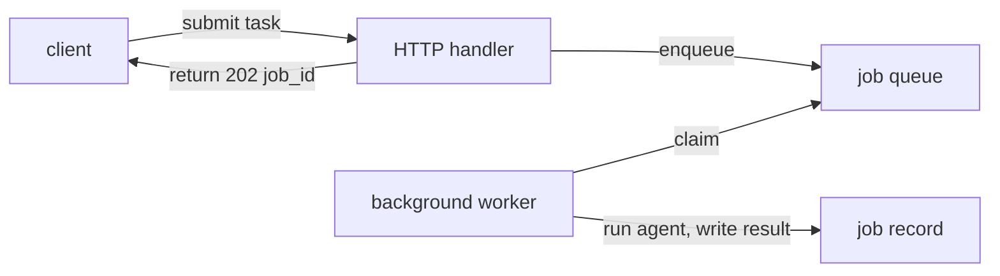

# Production deployment — the async job API

## Never block the request

An agent turn is slow. A single request might call three tools, wait on a model twice, and grade an
essay — seconds, sometimes minutes. If your HTTP handler *does* that work inline and only returns when
it finishes, you have built a **blocking** endpoint: the connection is held open, a worker thread (or
event-loop slot) is pinned for the whole run, and a browser or proxy will time out long before a
long agent task completes. Ten slow users and your server is out of threads.

The rule for turning an agent into a service is: **never block the request thread on the agent run.**
The HTTP handler should do only fast, bounded work — accept the request, validate it, enqueue the
job — and return immediately. The slow work happens *off* the request, on a background worker. The
request thread is a scarce, latency-sensitive resource; long-running agent work does not belong on it.

```python
# BLOCKING — do not do this: the handler waits for the whole agent run.
def handle_submit(req):
    result = run_agent(req.task)   # seconds to minutes; the thread is pinned
    return {"result": result}       # caller waited the entire time
```

This is the same discipline as [production failure modes](../production-failure-modes/) preaches for
timeouts and backpressure: a request that can take arbitrarily long must be made *bounded* from the
caller's point of view. The way you bound it is to hand the work to a queue and answer right away.

## Return a job id

So the handler enqueues the work and returns a **job id** instead of a result. Submitting a task is a
fast write: create a **job** record with status `"queued"`, store it, and return its id. The caller
gets a small, immediate response it can hold onto — the run has not happened yet, but it has been
*accepted*.

```python
# FastAPI-style handler: accept → enqueue → return a job id immediately.
def handle_submit(req) -> dict:
    job_id = job_queue.submit(req.task)   # fast write, status "queued"
    return {"job_id": job_id, "status": "queued"}   # returns in milliseconds
```

The response is `202 Accepted`, not `200 OK` with the answer: you are telling the caller *"I have your
work, here is its handle."* A **background job** — a worker pulling from the queue — does the actual
agent run later and writes the result back against that id. The request thread was never blocked; it
touched a queue and returned. This is exactly the shape of this repo's own async grading path: the
[apply route enqueues a job](../../../web/app/api/apply/route.ts) and returns a `jobId` while the
[grading worker](../../../packages/grading/src/worker.ts) grades it off the request.



The one thing the caller now needs is a way to ask *"is my job done yet?"* — which is the next lesson:
[polling for the result](../lesson-jobs).
