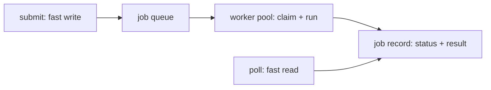

# Production deployment — async job API roadmap

## Roadmap: async job API

**What this section covers.** How you turn a slow agent run into a service that stays responsive:
accept the work, return a job id immediately, do the run off the request thread, and let the caller
poll for the result — plus the durability that keeps that contract alive under retries and many workers.

**The ideas you'll meet:**

- **Blocking endpoint** — an HTTP handler that runs the agent inline and pins a thread for the whole run; the thing to avoid.
- **Job id** — the handle `submit` returns immediately (`202 Accepted`) so the caller can ask about work that hasn't run yet.
- **Polling** — a fast status read that reports `queued → running → (done | failed)` until a terminal state.
- **Idempotency key** — a client-supplied key so a retried submit returns the existing job instead of a duplicate run.
- **Dead-letter queue** — where a job goes after bounded retries with backoff still fail, instead of retrying forever.
- **Atomic claim** — `FOR UPDATE SKIP LOCKED` so two workers in a pool never grab the same job.
- **Task queue & worker pool** — the named pattern (Celery/RQ) the whole submit/poll shape is an instance of.

**Why it matters.** This submit/poll split is the load-bearing move that decouples request latency from
run latency — everything else in production deployment (rate limiting, rollout) sits on top of it.
