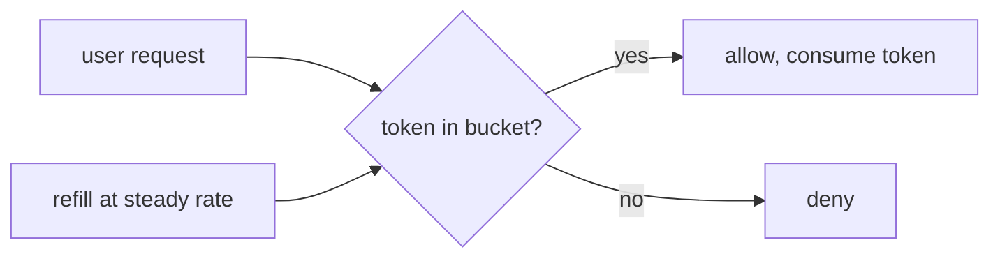

# Production deployment — rate limiting roadmap

## Roadmap: rate limiting

**What this section covers.** Why a shared agent service has to cap every user, and the token-bucket
mechanism that turns "be fair" into a concrete, checkable rule — allowing short bursts while holding a
steady average rate.

**The ideas you'll meet:**

- **Token bucket** — a per-user bucket of up to `capacity` tokens that refills at `refill_per_sec`; each request tries to take one.
- **Allow vs. deny** — a request with a token available is allowed and consumes it; an empty bucket denies the request.
- **Burst vs. average rate** — the bucket permits `capacity` requests back-to-back but throttles to `refill_per_sec` over time.
- **Injected clock** — passing `now` in (rather than reading it inside) makes the limiter deterministic and testable.
- **Per-tenant fairness** — the enforcement half of multi-tenant isolation, so one caller can't drain the pool or the budget.

**Why it matters.** Without a per-user cap, one buggy or hostile client can starve the worker pool and
run up the token bill for everyone — rate limiting is what keeps one tenant from becoming everyone's outage.
