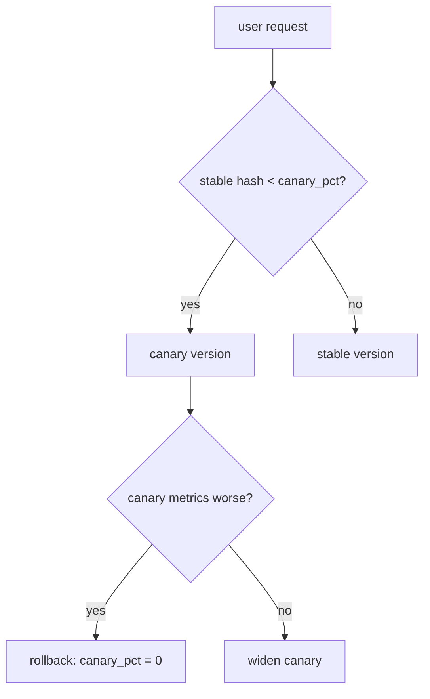

# Production deployment — safe rollout roadmap

## Roadmap: safe rollout and rollback

**What this section covers.** How to ship a new agent version without shipping an outage: route a small
slice of traffic to the new version, watch its metrics, and either widen it or pull it back with one
dial — then the frontier where that ramp becomes automated and metric-gated.

**The ideas you'll meet:**

- **Canary** — routing a fraction of users to the new version while everyone else stays on the stable one.
- **Sticky hash routing** — a stable hash of the user id (not `hash()`, not a coin flip) so a user always lands on the same side.
- **`canary_pct` dial** — the one knob you turn to grow the canary 5% → 50% → 100% or set it back to 0.
- **Rollback** — one command back to the last known-good version; instant, unlike rolling forward with a fix mid-incident.
- **Feature flag** — a runtime toggle that ramps a behavior independently of a code deploy and kills it instantly.
- **Progressive delivery** — automated ramp-ups gated on live metrics; canary generalized.
- **Eval gate** — the open frontier of using a quality eval on canary traffic to auto-promote or auto-rollback.

**Why it matters.** The whole loop — canary a slice, watch the errors, rollback on regression — is what
lets you deploy an agent often without deploying an outage often.
