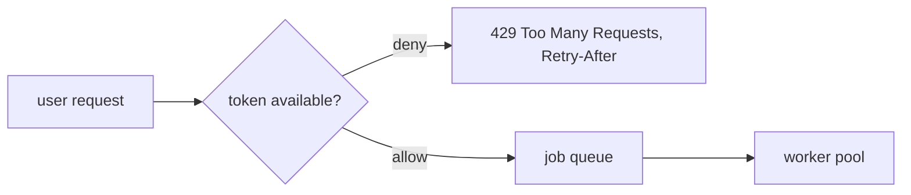

## The operability canon: backpressure and safe rollout

**In brief.** The token bucket and the canary are concrete mechanisms sitting on top of the job queue.
Each is one instance of a named industry practice, and the expert read is knowing the practice — plus
which layer hands you a hard **guarantee** versus a **best effort**.

**The named patterns.**

- **Backpressure** — the single idea behind rate limiting, bounded queues, and load shedding: bound the work you **accept** so overload becomes a clean rejection instead of a collapse. It is the same discipline the async job API applies to duration — a request that could take arbitrarily long is made bounded from the caller's point of view. Without it, one caller's flood drains the worker pool and the token budget, and one tenant becomes everyone's outage.
- **Admission control** — where the per-user token bucket sits: at the edge, in front of the pool. It rejects excess load **before** that load ever reaches a worker, which is why the cap is enforced on submit rather than inside the run.
- **Denying correctly** — an empty bucket means `429 Too Many Requests`, ideally with a `Retry-After` hint so the client backs off. It is not `200 OK` (that hides the throttle from a client that assumes success), not `500` (nothing broke — the rule worked as designed), and not holding the connection open until a token refills, which would reintroduce exactly the blocking the async job API exists to remove.
- **Blue-green vs. canary** — two points on the safe-rollout spectrum. **Blue-green** keeps two complete environments and flips all traffic at once, so rollback is flipping back: it minimizes switch time. A **canary** ramps a small sticky slice first: it limits blast radius. Both are built around keeping a known-good version and making the return to it one command.
- **Guarantee vs. best effort** — the atomic claim and a hard rate cap **guarantee** something (disjoint jobs, a bounded rate). A canary only **best-effort** catches a bad deploy early: it bounds the damage, it does not prove the new version good.

**Why it matters.** Backpressure is what turns overload into a clean `429` instead of a meltdown, and the
rollout spectrum is what turns a bad version into a bounded incident — both rest on bounding what you
accept and keeping a known-good version one command away.
