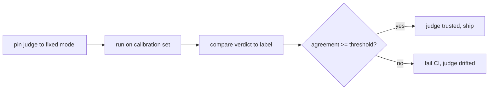

# Evaluation & quality — calibrating the judge

## Calibrate the judge

The judge is part of your measuring instrument, and instruments drift. Swap the judge model, reword a
rubric to "clarify" it, or bump a version, and the *same* outputs can start scoring differently — not
because the agent changed, but because the ruler did. If you don't notice, every pass-rate built on that
judge is quietly corrupted, and a "regression" you chase for a day turns out to be the judge moving under
you. The discipline that catches this is **calibration**.

A **calibration set** is a small fixed collection of labeled exemplars — clear passes and clear fails,
each with the verdict a human already agreed on. You pin the judge to a specific model and run it against
the calibration set; if it stops reproducing the known verdicts, the judge changed and you catch it before
it ships.



```python
def check_judge(judge, calibration):
    # calibration: [{"answer": ..., "expect": "pass" | "fail"}, ...]
    agree = sum(1 for c in calibration if judge(c["answer"]).verdict == c["expect"])
    return agree / len(calibration)      # judge-vs-label agreement; gate on it
```

Two properties make the set do its job. Keep the cases **unambiguous** — clear passes and clear fails, not
borderline ones — so a drop in agreement means the judge moved, not that the case was a coin flip. And
**gate on the agreement**: wire the calibration check into CI so a judge that no longer reproduces its
labels fails the build, exactly like a deploy gate one level up. This repo's own **meta-eval gate** is the
worked example — every eval skill ships a calibration file, and the gate fails CI when the pinned judge's
agreement with those labeled cases drops below its threshold, so a change that breaks grading cannot merge.

Calibration is necessary but not sufficient: a judge that agrees with humans on 200 labeled cases can
still drift on the long tail of real outputs. So you re-calibrate when you change the judge, and you keep
sampling live cases for human review — because the one number that must stay honest is the pass-rate, and
it is only as honest as the judge that produces it.
