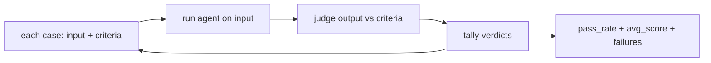

# Evaluation & quality — the eval suite

## Run the whole suite

One graded example is an anecdote. An **eval suite** is the set of cases you run *every* time — a fixed
collection of tasks, each with the criteria that define success — so a single number summarizes how the
agent does across the whole distribution, not just the one case you happened to try. The suite is the
agent's test suite: you run it before you ship, and you run it after every change.

The loop is mechanical: for each case, run the agent on the input, judge the output against that case's
criteria, and tally the verdicts.



```python
def run_suite(agent, cases, judge):
    results = [judge(c, agent(c["input"])) for c in cases]
    passed = [r for r in results if r["passed"]]
    return {
        "pass_rate": len(passed) / len(cases),               # the headline metric
        "avg_score": sum(r["score"] for r in results) / len(cases),
        "failed": [c["input"] for c, r in zip(cases, results) if not r["passed"]],
    }
```

The headline number is the **pass_rate** — the fraction of cases the agent got right. Alongside it, keep
the **avg_score** (how good the passes were, not just how many) and, crucially, the *list of failures*.
An aggregate that only reports "73%" hides which cases broke; a suite that returns the failed inputs
turns a bad run into a debuggable one. This mirrors the discipline in
[retrieval-evals](../../retrieval-evals/), applied to whole-agent tasks.

## Track the four metrics

Pass-rate is the summary, but for an *agent* four metrics tell the real story — and each one gates a
different kind of failure:

- **Completion** — did the agent finish the task at all (reach an answer, not stall or loop)?
- **Accuracy** — was the finished answer *correct* against the criteria?
- **Hallucination** — did it fabricate facts, tool results, or citations? This is tracked *separately*
  because a fluent, confident, wrong answer is worse than an honest failure, and accuracy alone can hide
  it.
- **Cost** — tokens, tool calls, and latency per task. An agent that is accurate but ten times more
  expensive may still be a regression.

Tracking all four is what lets you catch a **regression**: a change that improves one metric while
silently degrading another. A prompt tweak that lifts accuracy two points but doubles hallucinations is a
regression, and you only see it because you tracked hallucination separately. The whole reason to run the
suite on every change is to catch regressions *before* they ship — a metric that only moves in reports
you read after an incident is not protecting anyone. This repo's meta-eval gate is the same idea one
level up: it runs the judge against calibration cases on every change and reports when a metric slips.
