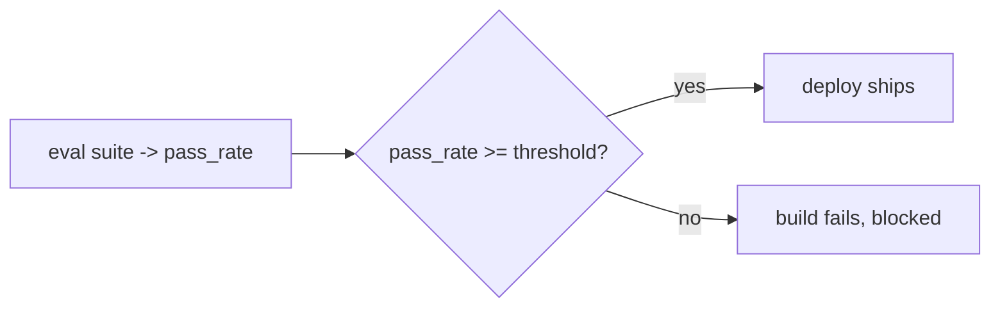

# Evaluation & quality — deploy gates roadmap

## Roadmap: deploy gates

**What this section covers.** How a pass-rate stops being a number you merely look at and becomes a
*deploy gate*: an automated, mechanical check that blocks any release whose suite score falls below a
fixed threshold — no exceptions, no matter how good the change feels.

**The ideas you'll meet:**

- **Deploy gate** — an automated check that blocks the release when the suite's pass-rate is below the bar.
- **Threshold** — the minimum acceptable pass-rate, a policy set once and enforced automatically; the comparison is `>=`, so landing exactly on the bar passes.
- **Mechanical enforcement** — a gate a human can wave a borderline run through is not a gate, because the exception always gets taken under deadline pressure.

**Why it matters.** Measuring without gating is the core anti-pattern; the gate is what makes "we'll fix the
evals later" impossible and turns a score into a guarantee.
