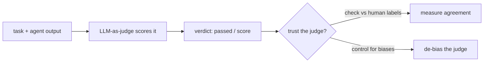

# Evaluation & quality — LLM-as-judge roadmap

## Roadmap: LLM-as-judge

**What this section covers.** How you turn "seems fine" into a number: use a separate model call —
an *LLM-as-judge* — to grade agent outputs that have no single correct string, and stay skeptical of
that judge, because it inherits every failure mode of the models it grades.

**The ideas you'll meet:**

- **Judgment** — the unit of measurement: given a task and an output, did the output do what the task required?
- **LLM-as-judge** — a separate, evaluation-only model call whose one job is to read the task and output and return a verdict.
- **Best model as judge** — grading is often harder than the task, so a weak judge corrupts every number downstream; spend on the judge.
- **Agreement with human labels** — the judge is trustworthy only to the extent its verdicts match a hand-labeled sample.
- **Judge bias** — documented, reproducible tilts: *position bias*, *verbosity bias*, and *self-preference*, which you must name to control.

**Why it matters.** Every number in this topic — pass-rates, gates, regressions — is only as honest as
the judge that produces it, so learning to build *and doubt* the judge is the foundation everything else
stands on.
