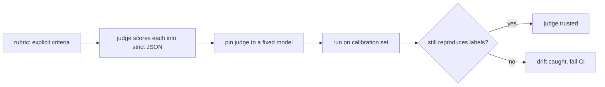

# Evaluation & quality — rubrics and calibration roadmap

## Roadmap: rubrics and calibration

**What this section covers.** How to make a judge's verdict *reproducible*: replace "is this good?" with
an explicit *rubric* the judge scores criterion by criterion into strict JSON, then *calibrate* the judge
against labeled exemplars so you catch it when the ruler itself drifts.

**The ideas you'll meet:**

- **Rubric** — a list of explicit criteria, each judged independently, so the score is a function of output and criteria, not the judge's mood.
- **Criteria** — the named things an output must hit; recording *which* one failed turns a dropped number into a debuggable report.
- **Strict JSON verdict** — a fixed schema (`passed`, `score`, `reasoning`) so a hundred judgments roll up into one pass-rate.
- **Calibration** — pinning the judge to a fixed model and checking it against known verdicts so a change to the judge is caught.
- **Calibration set** — a small, fixed collection of unambiguous labeled exemplars — clear passes and clear fails.
- **Judge drift** — when the same outputs start scoring differently because the ruler moved, not the agent.

**Why it matters.** A rubric makes a verdict defensible and calibration keeps it stable over time — together
they are what let a pass-rate mean the same thing this week as it did last week.
