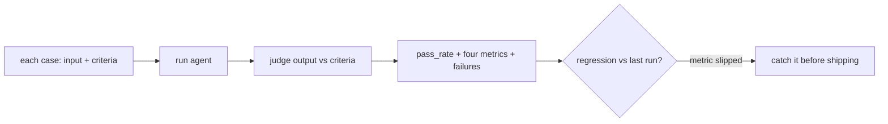

# Evaluation & quality — eval suites and metrics roadmap

## Roadmap: eval suites and metrics

**What this section covers.** How one graded example becomes a measurement you can trust: run a fixed
*eval suite* on every change, summarize it as a *pass-rate* plus a handful of metrics, and use those to
catch *regressions* — then look to the frontier where the thing being scored is a whole agent trajectory.

**The ideas you'll meet:**

- **Eval suite** — the fixed set of cases you run every time, so one number summarizes the whole distribution, not the one case you tried.
- **pass_rate** — the headline metric: the fraction of cases the agent got right, kept alongside `avg_score` and the list of failures.
- **The four metrics** — *completion*, *accuracy*, *hallucination* (tracked separately), and *cost*, each gating a different kind of failure.
- **Regression** — a change that lifts one metric while silently degrading another; you only see it because you track all four.
- **Agentic benchmarks** — suites like SWE-bench and τ-bench that score whether an agent *completed a real task*, not prose quality.
- **Trajectory evaluation** — grading the *sequence* of tool calls, not just the final answer; harder than scoring a response, and an active research edge.

**Why it matters.** A metric you only read after an incident protects no one; a suite wired to run on every
change turns a bad edit into a caught regression before it ships.
