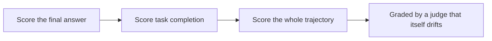

## The frontier of agent evals

**In brief.** The judge, the rubric, the suite, and the deploy gate are the solid ground — enough to
measure and gate a real agent. The frontier is where grading **agents specifically** gets hard: the thing
being scored is no longer a single answer but a long trajectory of tool calls, and the judge grading it is
itself a fallible model. None of these three is solved, and a single pass-rate captures none of them.

**The three open problems.**

- **Agentic and task-completion benchmarks** — the field moved from grading a single response to grading whether an agent completed a real task end to end: install this package, resolve this GitHub issue, book this trip. **SWE-bench** (resolve real repository issues) and **τ-bench** and other tool-use suites score task completion, not prose quality. The open problem: a pass or fail on a **final state hides how the agent got there**, and a task that passes today can break on a silent dependency change tomorrow.
- **Trajectory evaluation** — for a multi-step agent the final answer is not the whole story: a run can reach the right end state through a wrong, wasteful, or unsafe path. Trajectory eval grades the **sequence of tool calls** — did it take a sane route, avoid destructive actions, stay grounded — not just the last message. Scoring a trajectory is far harder than scoring an answer, and it is an active research edge, not a solved metric.
- **Judge reliability at scale** — a judge that agrees with human labels on 200 calibration cases can still **drift on the long tail** of real outputs, and its known biases (position, verbosity, self-preference) **compound** when it grades thousands of trajectories unsupervised. A single passing calibration run is a necessary check, not a guarantee at volume. Keeping the judge honest means re-calibrating, de-biasing, and sampling live cases into human review — the reliability problem sitting underneath every automated eval.

**Why it matters.** These three attack the same gap the whole topic stands on — you cannot improve what
you cannot measure — at the scale where the thing measured is a whole agent and the instrument is itself a
model; an expert can say which to invest in first, and does not pretend one pass-rate captures a
long-horizon agent.
