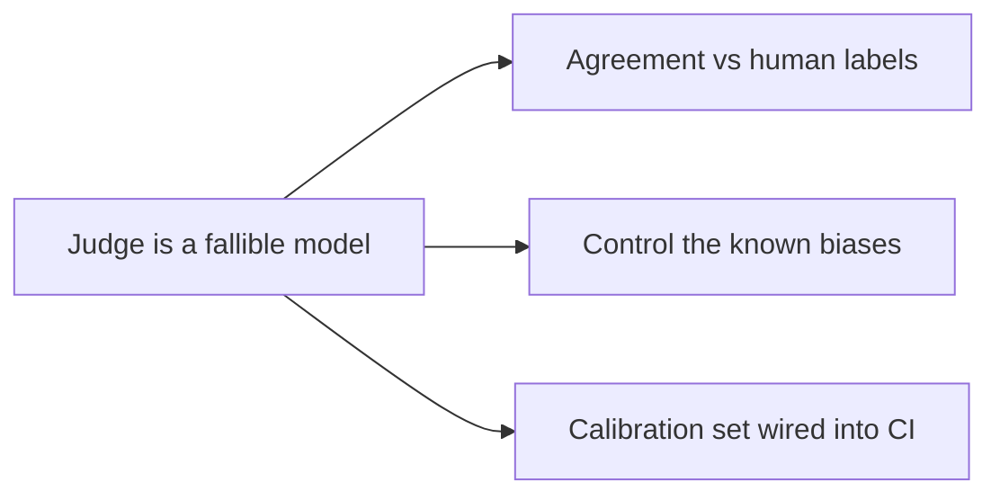

## Judging the judge

**In brief.** A judge is a model, so it inherits every failure mode of models: it can be biased,
inconsistent, and confidently wrong. Before you gate deploys on a judge you validate the judge — three
legs: agreement with human labels, control for the known biases, and calibration against labeled
exemplars.

**How you validate a judge.**

- **Agreement with human labels** — the judge is trustworthy only to the extent its verdicts match human-labeled examples. Measure it the way you measure any classifier: label a sample by hand, run the judge on the same sample, and report agreement (accuracy against the labels, or correlation with human scores). A judge that disagrees with humans is not a judge, it is noise.
- **Position bias** — favoring the first answer in a pairwise comparison. Control it by randomizing answer order.
- **Verbosity bias** — rating longer answers higher regardless of quality. Control it by capping or normalizing length.
- **Self-preference** — a model rating its own family of outputs more highly. Control it by preferring a judge from a **different model family than the agent**, so the pass-rate reflects quality rather than family affinity. This is also why the judge is a separate evaluation-only call and never the agent grading itself.
- **Calibration set** — a small, fixed collection of labeled exemplars, clear passes and clear fails, each with a verdict a human already agreed on. You pin the judge to a specific model and run it against the set; if it stops reproducing the known verdicts, the judge changed — a new model, a reworded rubric — and you catch it before it silently corrupts every pass-rate built on it. Keep the cases **unambiguous** so a drop in agreement means the judge moved, not that the case was a coin flip, and **gate on the agreement** so a drifted judge fails the build.
- **Meta-eval** — the eval that evaluates the evaluator: it checks that the judge still reproduces its labeled exemplars, rather than checking the agent. This repo's own meta-eval gate is the worked example — every eval skill ships a calibration file, and `npm run eval-gate` fails CI when the pinned judge's agreement with those labeled cases drops below its threshold, so a change that breaks grading cannot merge.

**Where the method comes from.** LLM-as-judge for open-ended outputs was popularized by **Zheng et al.,
"Judging LLM-as-a-Judge with MT-Bench and Chatbot Arena" (2023)**, which both established the method and
documented its biases.

**Why it matters.** Knowing that a judge must be measured, de-biased, and calibrated — not just trusted —
is what separates a real eval harness from a number generator, because every number downstream is only as
honest as the judge that produced it.
