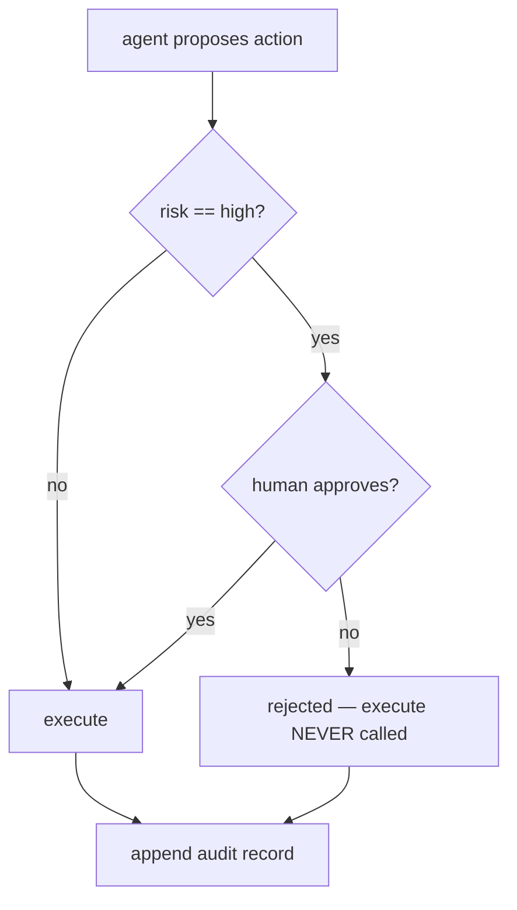

# Human-in-the-Loop — approval gate roadmap

## Roadmap: Gating with human approval

**What this section covers.** The mechanism that puts a human in the loop for exactly the actions that
can't be taken back — the approval gate — and the design judgment that keeps that oversight real
instead of a rubber stamp.

**The ideas you'll meet:**

- **Approval gate** — the seam between the agent's intent and the world's state, with a human standing in it for high-risk actions.
- **Execute is never called on reject** — the defining property of a gate: a rejected action simply does not happen, turning a confidently-wrong call into a recoverable pause.
- **The tier boundary** — where "gate this" starts; too coarse and irreversible actions slip through, too fine and reviewers habituate.
- **Habituation / rubber-stamping** — flood a reviewer with routine prompts and they stop reading and start clicking yes, weakening the one gate that mattered.
- **The approval surface** — a meaningful request shows the action, its parameters, the risk level, and enough context to actually judge.
- **Batch, don't flood** — present 500 deletions as one scoped, reviewable action rather than 500 separate prompts.
- **Escalation & route-to-authority** — hand only the hard cases to a human, and send them to someone empowered to approve.
- **Ask-when-unsure** — gate not just by a fixed action list but by the agent's own calibrated confidence.

**Why it matters.** A gate that a reviewer actually reads is worth more than ten they wave through;
placing the boundary and designing the surface is what makes the human in the loop a genuine check.
