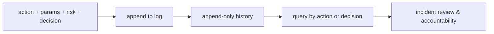

# Human-in-the-Loop — audit trail roadmap

## Roadmap: The audit trail

**What this section covers.** The accountability layer that records *what the agent did and why* — an
append-only, queryable log of every consequential decision — so a wrong action is a traceable event
rather than an unexplained mystery.

**The ideas you'll meet:**

- **Audit trail** — a durable record of the action, its parameters, the risk level, and whether it was approved, rejected, or executed.
- **Append-only** — you add records and never rewrite history, so the trace can't be quietly edited after the fact.
- **Queryable** — you can pull every `charge_payment` or every rejected action to review a pattern, not just read a wall of text.
- **Ordered timeline** — records are kept in the sequence decisions were made, so the trail reconstructs the actual chain of events.
- **Accountability** — the log is how you answer "who approved this charge, and on what basis?" after the fact, and how you fix the gate.

**Why it matters.** The audit trail is what makes autonomy *defensible*: without it you can see the
damaged state but never the reasoning and approvals that produced it.
