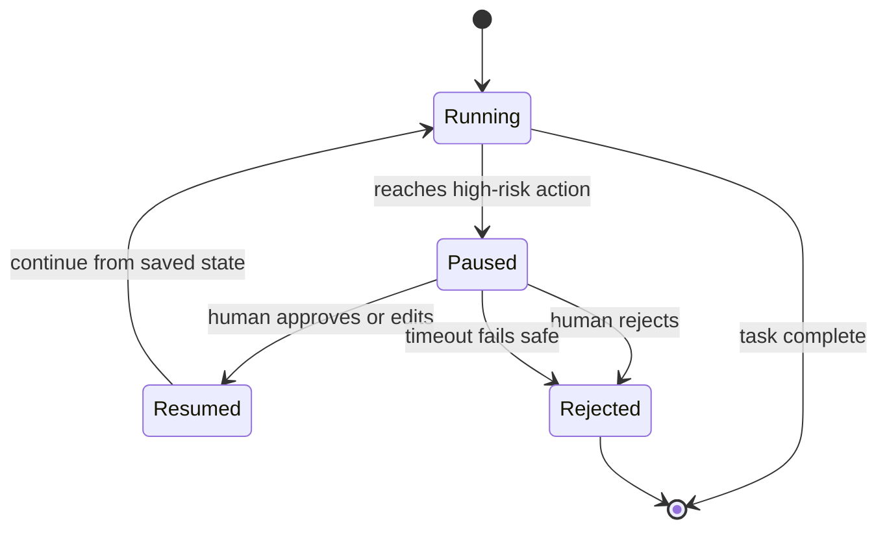

# Human-in-the-Loop — pause & resume roadmap

## Roadmap: Pause, step in, resume

**What this section covers.** The full lifecycle of a gated action — the agent runs until it hits a
high-risk step and pauses, a human steps in, and the agent resumes cleanly from where it stopped — plus
the timeout that keeps a pause from hanging forever or silently escalating.

**The ideas you'll meet:**

- **Pause, step in, resume** — the three beats of a human-in-the-loop action: run until a gate, wait for a human, continue with their decision folded in.
- **Durable pause** — the agent's plan, messages, and pending action are persisted, so a person can take minutes or days and it still resumes correctly.
- **Interrupt / checkpoint** — the framework primitive (e.g. LangGraph) that halts a run at a checkpoint and continues from it, rather than an in-memory `input()`.
- **Clean resumption** — picking up the plan without re-doing finished work or losing context (and idempotently, so a replayed action can't double-apply).
- **Timeout** — every gate needs a window, because a human might never answer.
- **Fail safe** — on timeout, default to *rejected*, never to *executed* — never auto-approve because a reviewer went to lunch.

**Why it matters.** An approval gate is only real if the agent can actually stop and wait; clean,
fail-safe resumption is what turns a pause into a safe checkpoint instead of a hang or an unapproved
action.
