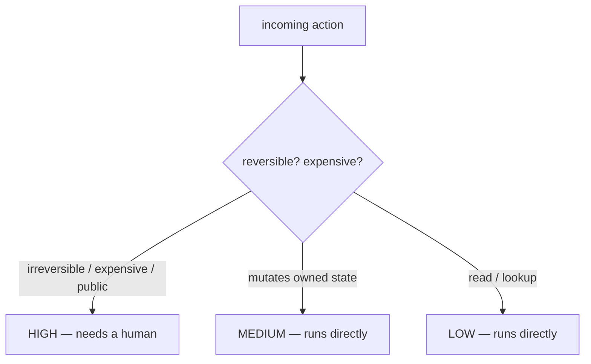

# Human-in-the-Loop — risk classification roadmap

## Roadmap: Classifying actions by risk

**What this section covers.** Why an agent that can *act* can act *wrongly*, and how to rank each
action by how much damage it can do — so you know which actions need a human and which can run at full
speed.

**The ideas you'll meet:**

- **Autonomy is dangerous** — the moment an agent can call a tool it can move real money, delete real rows, and send real email; a bad *sentence* becomes a bad *charge*.
- **Risk level** — a low / medium / high ordinal that turns "should a human approve this?" from a vibe into a lookup.
- **Irreversible** — the load-bearing axis: a wrong reversible action is an inconvenience, a wrong irreversible one is a permanent fact about the world.
- **Reversibility × cost** — the two questions that set the tier: can it be undone, and how much does it cost?
- **The autonomy spectrum** — oversight is a dial (manual → approve-each → approve-high-risk → interruptible → autonomous), not a switch, chosen per action.
- **Calibrated confidence** — gating by the model's own certainty is only safe if a 95%-confident model is actually right 95% of the time.

**Why it matters.** Every gate, audit, and pause downstream is only as good as this classification —
get the risk tier wrong and either irreversible actions slip through ungated or reviewers drown in
low-stakes prompts.
