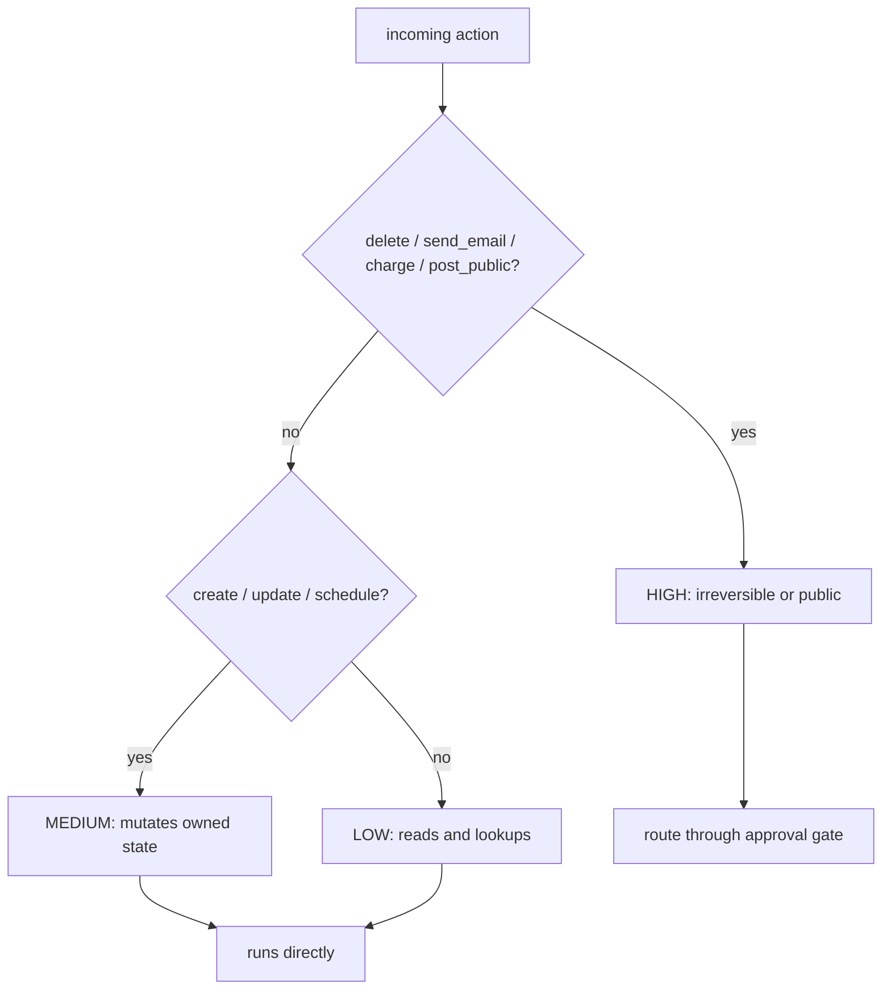

# Human-in-the-loop — why full autonomy is dangerous

## Autonomy is dangerous

An agent that can call tools can *act on the world*, and the moment it can act it can act **wrongly**.
A model that only talks produces a bad sentence; an agent with a `charge_payment` tool produces a bad
charge. The failure modes that were harmless in a chatbot — a hallucinated argument, a misread intent,
a confidently wrong plan — now move real money, delete real rows, and send real email to real people.
Full autonomy sounds great right up until the agent does something expensive and irreversible.

The fix is not "make the model perfect" — you cannot. The fix is to keep a **human on the actions that
matter**. Not every action: gating a read behind a human approval is pointless friction. The skill is
deciding *which* actions need a person in the loop, and letting the rest run at full speed. That
decision is a risk judgment, and you make it per action, not per agent.

```python
# The dangerous shape: the agent decides AND acts, with nobody in between.
result = tools[resp.tool_name](resp.tool_input)   # what if tool_name == "delete_user"?
```

This is the same trust boundary that [agent-guardrails-budgets](../agent-guardrails-budgets/) draws
around cost and that [safety-engineering](../safety-engineering/) draws around unsafe outputs: the
model is an untrusted actor, and a person is the last line of defense on the actions you cannot take
back. When the agent is unsure, the right move is often not to *act* but to *ask*.

## Classify actions by risk

Before you can gate anything, you have to rank actions by how much damage they can do. The cheapest
useful model is a small ordinal scale — **low / medium / high** — driven by two questions: is the
action *reversible*, and is it *expensive*? A database read is low: reversible and cheap. Creating a
draft is medium: it changes owned state but you can undo it. Charging a card, deleting a user, or
posting in public is **high**: irreversible, expensive, or visible to the outside world.

```python
from enum import Enum

class Risk(str, Enum):
    LOW = "low"
    MEDIUM = "medium"
    HIGH = "high"

def assess_risk(action: str) -> Risk:
    if action.startswith(("delete", "send_email", "charge_payment", "post_public")):
        return Risk.HIGH          # irreversible / expensive / public
    if action.startswith(("create", "update", "schedule")):
        return Risk.MEDIUM        # mutates owned state, but recoverable
    return Risk.LOW               # reads and lookups
```



The word doing the work here is **irreversible**. A wrong reversible action is an inconvenience — you
undo it. A wrong *irreversible* action is a permanent fact about the world, and no amount of
after-the-fact logging brings the money back. That is why high risk maps to irreversibility first and
cost second: those are exactly the actions where a human's yes/no is worth the latency.

Classifying by risk turns "should a human approve this?" from a vibe into a lookup. High-risk actions
route through an approval gate; everything else runs. The next lesson wires that gate, and it leans on
the same per-tenant trust reasoning as [multi-tenant-isolation](../multi-tenant-isolation/): the more
an action can hurt, the more it has to prove before it runs.
