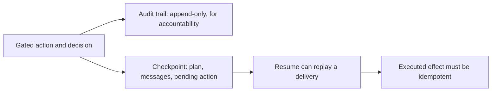

## Durable state, replay, and the audit trail

**In brief.** A gated agent keeps two durable views of the same history, and they are not the same
object: the audit trail exists for accountability and must never be rewritten, while the checkpoint
exists for continuation and is what the agent resumes from. Making either editable, or assuming one
gives you the other, breaks the property that made it useful.

**Two records, two jobs.**

- **The audit trail** — a durable record of the action, its parameters, the risk level, and whether it was approved, rejected, or executed. It is append-only: you add records and never rewrite history, so the trace cannot be quietly edited after the fact. It is queryable, so you can pull every `charge_payment` or every rejected action. Its job is accountability — answering "who approved this charge, and on what basis?" once the action is already in the past.
- **The checkpoint** — the durable snapshot the run continues from: the agent's plan, its message history, and the specific pending action awaiting a decision. Its job is clean continuation — picking up mid-task without re-doing finished work or losing the context that made the pending action correct. This is why the pattern needs persisted state rather than an in-memory `input()` prompt.
- **Why they stay distinct** — the two overlap in content but serve different jobs, so persisting one does not hand you the other for free. An editable audit log forfeits exactly the accountability that justified keeping it.

**Replay and double-apply.**

- **A pause can be long** — state is saved precisely so a person can take minutes, hours, or days, and the process may exit and restart before any decision arrives.
- **Resume can deliver the same action twice** — because the run continues from a saved checkpoint rather than from scratch, an approved action can be replayed: a resume can repeat, a retry can re-fire.
- **Idempotency is the safeguard** — clean resumption requires that a replayed action cannot double-apply. The executed effect has to be safe to deliver more than once so that it lands at most once. Without that, a single human approval can produce two irreversible effects — two charges where the reviewer authorized one.

**Why it matters.** Durability is what makes pause-for-human real, but it is also what introduces
replay — so the gate's promise, that an irreversible effect happens only if a human said yes, holds
only when the effect is idempotent and the record of the decision is immutable.
