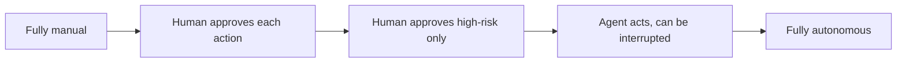

## The frontier — autonomy and scaling oversight

**In brief.** Risk gates, approval, audit, and clean resumption are the solid ground. The frontier is
deciding where on the autonomy spectrum a given action belongs, getting an agent to make that call for
itself, and keeping human attention meaningful as the volume of gated actions grows.

**The spectrum and its catch.**

- **Autonomy is a dial, not a switch** — fully manual, human-approves-each-action, human-approves-high-risk-only, agent-acts-but-can-be-interrupted, fully autonomous. The engineering question is which rung each action belongs on; the frontier question is whether the agent can place itself on the right rung.
- **Calibrated confidence is the hard part** — ask-when-unsure only works if the agent's sense of unsure is trustworthy. An over-confident model that is 95% sure but 70% right will barrel past the gate on exactly the actions it should have escalated. Getting stated confidence to match real accuracy is an open problem, and calibration has to be measured before confidence is trusted.
- **Irreversible actions stay gated regardless** — confidence buys no pass on the actions that cannot be taken back. Those route to a human whatever the model's stated certainty.
- **The moving line** — as models get more reliable, the economically correct amount of oversight drops. But the line moves per action and per stakes, not uniformly: the cost of a wrong `charge_payment` does not fall just because the model improved. An expert re-draws the line deliberately, action by action, rather than turning the whole agent loose at once.

**Scaling oversight.**

- **Volume is the threat to the gate** — routing every high-risk action to a single human does not scale, and the resulting flood drives habituation: the reviewer stops reading and rubber-stamps the queue.
- **Handing approval to another agent removes the human** — approving an irreversible action is exactly the decision the gate exists to put a person on. The human cannot be removed from the actions that cannot be taken back.
- **The defensible direction is surface design** — keep humans on the irreversible effects and re-engineer how the request is presented: collapse related actions into one reviewable request with its full scope shown, and route it to an approver empowered to say yes. Oversight has to fit human attention rather than defeat it.

**Why it matters.** This is the trust gradient the whole topic is built on — the model is an untrusted
actor — pushed to its limit: an expert names which actions can move toward autonomy, insists
calibration be measured before confidence is trusted, and never claims the human can be removed from
the irreversible actions.
