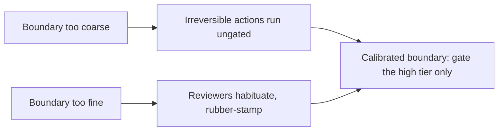

## Tiering risk and the cost of oversight

**In brief.** Classifying an action is only half the job. The other half is deciding where the gated
tier begins — and accepting that every gate you add spends a human's attention. Both directions of
error have a real cost, so the boundary is a deliberate design decision, not a default.

**The two axes.**

- **Reversibility first** — can the action be undone? A read is reversible and cheap (low). A create or update on state you own mutates but is recoverable (medium). A charge, a deletion, or a public post has no undo (high). Irreversibility is the load-bearing axis because a wrong irreversible action is a permanent fact about the world, and no amount of after-the-fact logging brings the money back.
- **Cost second** — how much does one call spend? Cost refines the classification and can still pull an action upward. An action can be fully reversible yet spend thousands of dollars on a single call, and that expense alone can push it toward the high tier. Collapsing risk to reversibility alone misses the expensive-but-recoverable case.

**The boundary is two-sided.**

- **Too coarse** — an irreversible action slips into a lower tier and runs ungated, which is the exact failure the gate existed to prevent.
- **Too fine** — gate every write and you drown reviewers in low-stakes prompts.
- **Oversight is not free** — every gate spends a human's attention and adds latency. It is a resource you allocate, not a safety measure you can add without limit.
- **Habituation** — flood a reviewer with hundreds of routine approvals and they stop reading and start clicking yes. The one high-risk deletion buried in the noise gets rubber-stamped along with everything else, so over-gating does not add safety — it actively weakens the gate that counts.

**The pattern family.**

- **Approval gates** — the action pauses and waits for an explicit human yes before an irreversible or expensive effect. This is the default for high-risk actions.
- **Escalation** — the agent handles what it is confident about and hands only the hard or ambiguous cases to a human, so most traffic still runs autonomously.
- **Confidence thresholds and ask-when-unsure** — gate by the agent's own confidence rather than a fixed action list. This needs calibrated uncertainty — a model that is 95% confident should be right 95% of the time — which is why over-confident models make the pattern dangerous.

**Why it matters.** The shared principle is oversight proportional to stakes: the more an action can
hurt, and the less sure the agent is, the more a human belongs in the loop. Tiering is the safety
mechanism that keeps human attention sharp when it lands, not a performance optimization.
