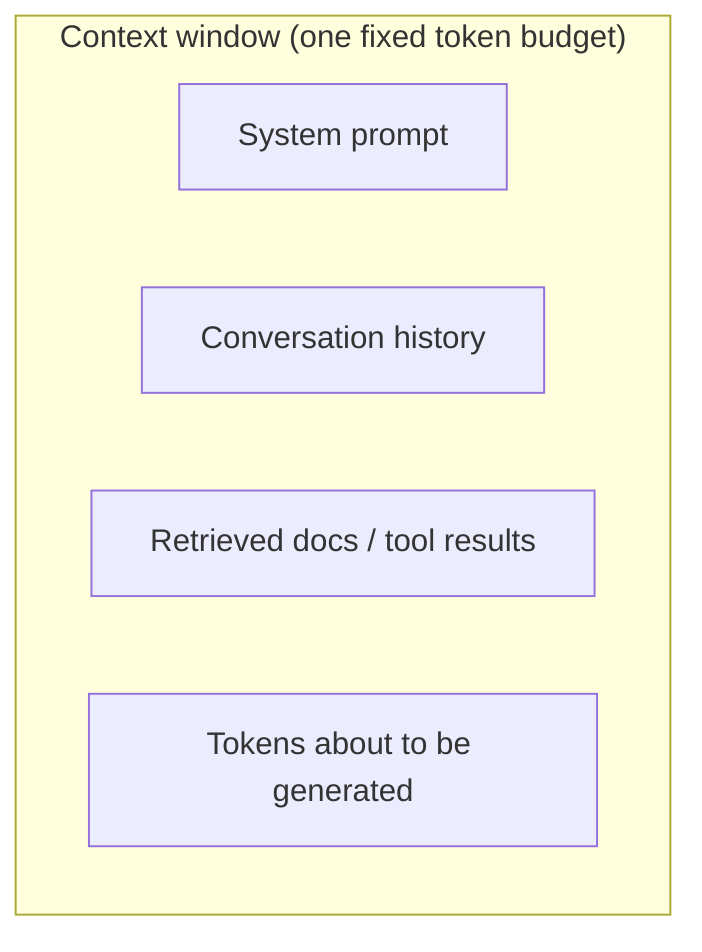

# LLM fundamentals for agents — context windows & token budgets

## The context window is a hard limit

A model does not have infinite memory. Every call has a **context window**: a fixed maximum number of
**tokens** the model can attend to at once. That budget has to hold *everything* the model sees in one
request — the system prompt, the whole conversation so far, any retrieved documents or tool results,
*and* the tokens the model is about to generate. It is not the size of the weights or how long the model
was trained; it is a per-call token allowance, and once you exceed it the request either errors or the
harness silently drops the oldest content.



For an agent this is the constraint that shapes the whole loop. A long-running agent accumulates tokens
turn after turn — user messages, its own replies, tool outputs — and the total only grows. Left
unmanaged it will eventually blow past the window. So a real agent treats context as a **budget** it
must fit under: keep the system prompt, keep the most recent and most relevant turns, and drop or
summarize the rest. (This topic's `context-budget` exercise implements exactly that trimming rule.)

```python
def fits(messages, max_tokens, count):
    return sum(count(m) for m in messages) <= max_tokens
```

The takeaway: reason about the model as a component with a finite input, not magic. See
[context-engineering](../context-engineering/topic.yaml) for how to fill that budget well.

## Tokens cost money and time

Tokens are also the unit of **cost** and **latency**. Providers bill per token — and almost always price
*input* tokens and *output* tokens differently — so a longer prompt or a longer answer is literally more
money. Because the model decodes autoregressively (one token per step), more output tokens also means
more wall-clock time. Tokens are the currency of both the bill and the clock.

That means you can compute what an agent run costs. Track input and output tokens per call, multiply each
by its per-token price, and sum over the run:

```python
def call_cost(in_tok, out_tok, price_in_per_1k, price_out_per_1k):
    return in_tok / 1000 * price_in_per_1k + out_tok / 1000 * price_out_per_1k
```

A run that makes ten calls with growing history can cost far more than the naive "ten small prompts"
intuition, because each call re-sends the accumulated context. Measuring cost per run — the
`cost-estimator` exercise below — is what lets you attribute spend and decide where a cheaper model would
do. See [cost-attribution](../cost-attribution/topic.yaml) and
[inference-stack-tradeoffs](../inference-stack-tradeoffs/topic.yaml).
