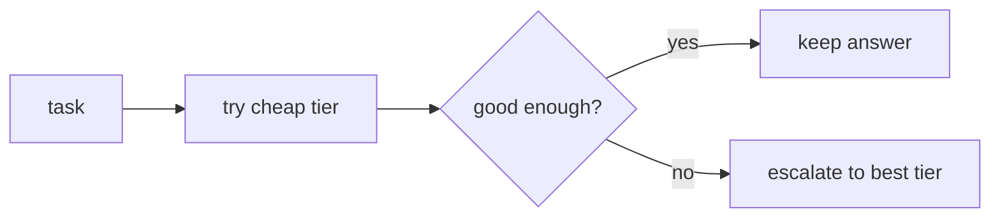

# LLM fundamentals for agents — the frontier of routing

## The frontier of routing

The hand-written router — "if the task is `classify` send it to the cheap model" — is the solid ground.
The frontier is where a *static* rule stops being enough and routing itself becomes a learned,
evaluated component.

- **Learned routers.** Instead of a fixed mapping, train a small classifier that predicts which tier can
  handle a request. It generalizes past the named tasks you hard-coded, but it is now a model that must be
  trained, calibrated, and evaluated — and it can misroute, sending a hard task to a weak tier.
- **Model cascades.** Try the cheapest tier first; if the answer clears a quality check, keep it,
  otherwise **escalate** to a stronger tier. This is the pattern popularized by **FrugalGPT** (Chen et
  al., 2023): a cascade plus a scoring step that decides whether the cheap answer is good enough. It
  captures most of the savings while protecting quality on the hard tail.
- **Confidence-based escalation.** Use a confidence signal — self-consistency, a verifier model, or a
  calibrated score — to decide *when* to spend on the expensive tier, rather than routing blindly up
  front. The honest read: this is a real cost/quality lever, not a solved problem. The router or verifier
  is itself fallible, so you evaluate it like any other model.

```python
def cascade(task, tiers, confident):
    answer = tiers["cheap"](task)
    return answer if confident(answer) else tiers["best"](task)  # escalate on low confidence
```



The reason to track this frontier: it is the same cost-vs-quality tradeoff the routing lesson is built
on, pushed to where the routing decision is learned and measured rather than assumed. See
[model-routing-fallback](../model-routing-fallback/topic.yaml) and `reading-list.md`.
