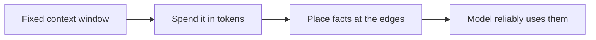

# LLM fundamentals for agents — context & tokens roadmap

## Roadmap: context windows and token budgets

**What this section covers.** How to reason about the model's input as a finite resource: every call has
a fixed token budget, tokens are the unit of cost and latency, and even when a fact fits, *where* it sits
in the window decides whether the model actually uses it.

**The ideas you'll meet:**

- **Context window** — the fixed maximum number of tokens a single call can attend to, holding prompt, history, tool results, and the output being generated.
- **Token** — the unit the window is measured in, and the unit providers bill and time by.
- **Token budget** — treating context as a limited allowance the agent must fit under by keeping recent, relevant turns and trimming the rest.
- **Lost in the middle** — the U-shaped retrieval curve: facts at the start or end are used well, facts in the middle are the most likely to be missed.

**Why it matters.** Context is the constraint that shapes the whole agent loop; getting the budget and
the placement right is what keeps a long-running agent both affordable and accurate.
