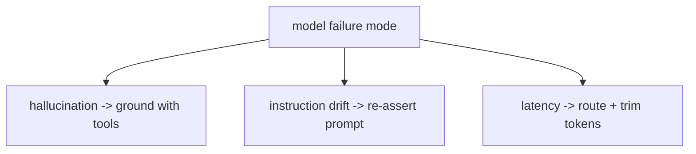

# LLM fundamentals for agents — where models fail roadmap

## Roadmap: where models fail

**What this section covers.** The named ways a model breaks and the concrete mitigation the *agent* — not
the model — owns for each: confident-but-ungrounded output, drift away from instructions over long
sessions, and latency on the hot path.

**The ideas you'll meet:**

- **Hallucination** — fluent, confident output not grounded in any real source; the mitigation is grounding claims with tools or retrieval.
- **Grounding** — fetching and validating facts against real sources instead of trusting the model's memory.
- **Instruction drift** — the model gradually stops following its system prompt as competing context accumulates; the mitigation is periodic re-assertion.
- **Latency** — more output tokens means more wall-clock time, degrading a hot path; the mitigation is routing to a faster tier and trimming the budget.

**Why it matters.** Knowing each failure by name and its paired mitigation is what turns "the model is
unreliable" into a set of concrete defenses the agent is responsible for building.
