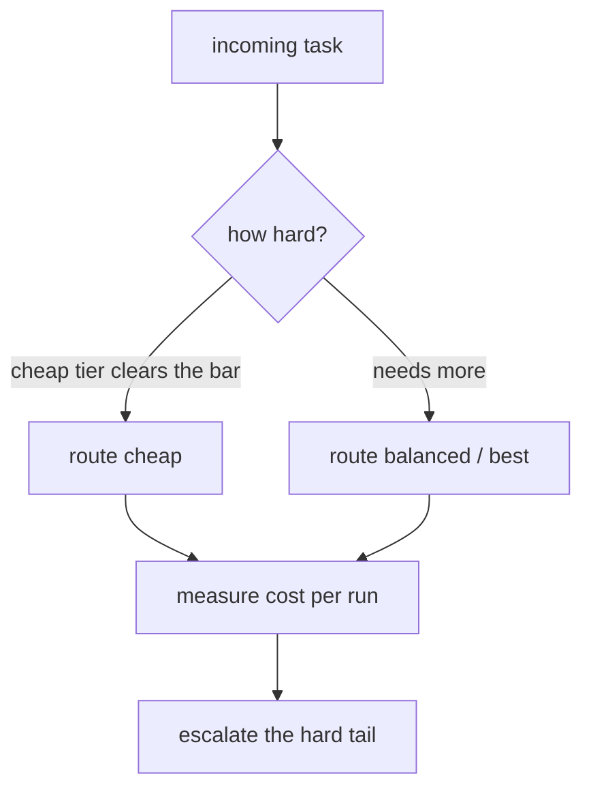

# LLM fundamentals for agents — routing & cost roadmap

## Roadmap: routing and cost

**What this section covers.** The economics of model choice: send each task to the cheapest tier that can
still do it, put a dollar figure on every run so those choices are evidence-based, and follow the
tradeoff to the frontier where routing itself becomes a learned, evaluated component.

**The ideas you'll meet:**

- **Routing** — sending each task to the cheapest model tier that still clears its quality bar, with an unknown task defaulting to the safe middle.
- **Model tier** — the cheap / balanced / best split you route across, trading capability for cost and latency.
- **Cost per run** — the sum of every call's input and output tokens priced separately, the number that lets you attribute spend.
- **Growing history** — why later calls dominate the bill: each call re-sends the accumulated context.
- **Cascade / escalation** — try the cheap tier first and escalate to a stronger tier only when a confidence check says the answer isn't good enough.

**Why it matters.** Routing plus cost accounting is what lets the cheap tier carry the volume while the
expensive tier is reserved for the tasks that truly need it — proven with evidence, not a hunch.
