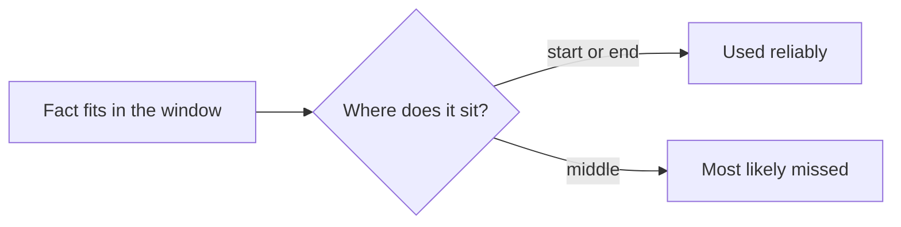

## Long context: what fits versus what gets used

**In brief.** A context window has two independent axes: how many tokens fit, and how reliably the model
uses a token once it is in there. The roadmap names the U-shaped curve; the deeper move is knowing what
the research actually measured, why a bigger window does not fix it, and where the frontier goes next.

**The two axes.**

- **Window size** — how many tokens a single call can hold: system prompt, history, retrieved documents, and the tokens being generated. This is the number a provider advertises.
- **Effective context** — how reliably the model uses tokens at every position. A model advertising a very large window can still degrade on mid-context retrieval, so "it fits" is a necessary but not sufficient condition for "the model will use it." Treating the two axes as synonyms is the standard mistake; effective context is not the training sequence length, and it is not the window minus some fixed subtraction.
- **The finding underneath** — "Lost in the Middle" (Liu et al., 2023) measured retrieval accuracy against the position of the relevant fact in a long input and found a U-shaped curve: high at the beginning and the end, dipping markedly in the middle. The result is positional and durable — the variable is where the fact sits, not how many tokens surround it.
- **Why a bigger window can make things worse** — growing the window raises the ceiling on what fits; it does not make attention uniform. Stuffing in more text lengthens the context, which enlarges the poorly attended middle and gives a key fact more room to get lost. A larger window does not shrink the token count of the same text, and the extra capacity is not reserved for anything that improves retrieval.
- **Where the frontier moves** — toward measuring effective use instead of trusting the headline size: probing reliable retrieval and reasoning at every position rather than asking only whether content fits. The engineering response is unchanged and still required — context engineering: order content by importance, retrieve the few most relevant passages instead of dumping everything, and keep the budget tight.

**Why it matters.** Placement matters as much as inclusion: put load-bearing instructions and the most
relevant passages at the start or end, keep the context tight, and never accept "we moved to a bigger
window" as the fix for a missed fact.
