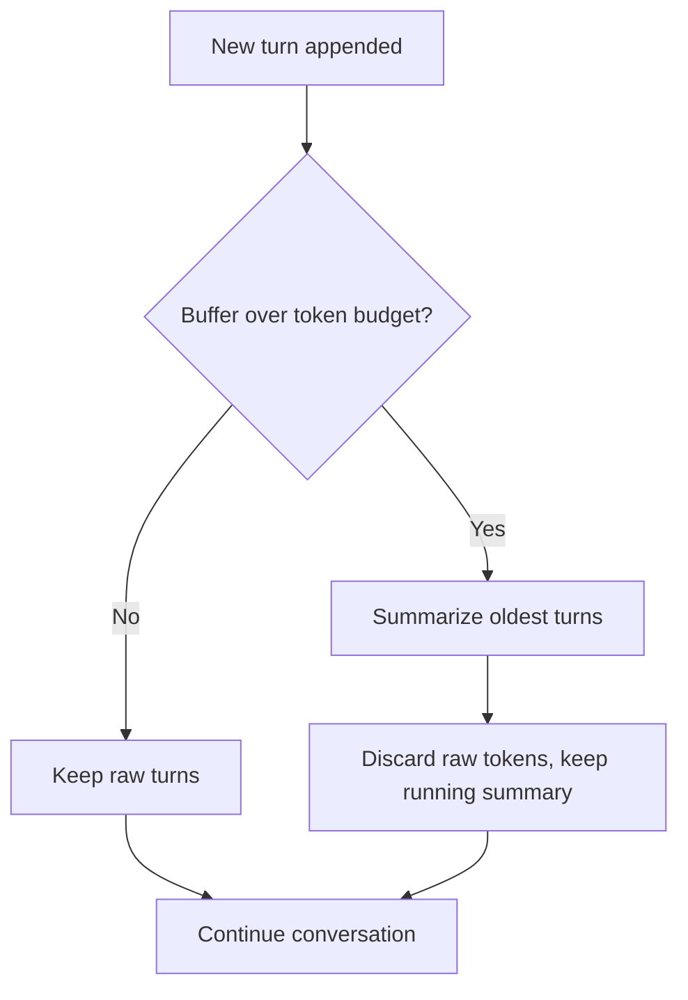

# Memory & state — compressing the context window

## The context window is finite

The short-term buffer cannot grow forever. The context window has a hard **token budget**, and a long
conversation will blow past it. You cannot just keep appending turns — at some point the oldest
messages must leave the window. Dropping them raw would erase what the agent learned; keeping them all
is impossible. The way out is **compression**: when the buffer exceeds its token budget, replace the
oldest turns with a compact **running summary** that preserves the essential facts while the raw
tokens are discarded.

This is summarization used as **consolidation**: many verbose turns collapse into a few sentences of
durable state, and the conversation continues with that summary standing in for everything it
replaced. The trigger is a **budget threshold** — you compress *when* the buffer would otherwise
overflow, not on every turn.

## What to keep, what to drop, and the risk

Compression is lossy on purpose, so *what* you keep is the whole game. Keep the load-bearing content:

- **Decisions** the agent or user made ("we chose Postgres", "the deadline is Friday").
- **Facts and constraints** established in the dialogue (names, ids, requirements, preferences).
- **Open tasks** — what still has to be done.

Drop the rest: greetings, chit-chat, restatements, and verbose reasoning whose *conclusion* you have
already captured. A good summary is the minutes of the meeting, not the transcript.

The risk is the flip side of the same coin: because compression is **lossy**, you can summarize away
something you later need. A detail that seemed irrelevant when you compressed can turn out to matter
three turns later, and it is now gone. That is the fundamental tension — you must drop tokens to fit
the budget, but every dropped token is a fact you are betting you won't need. Compress conservatively,
keep decisions and open tasks verbatim when you can, and treat aggressive summarization as a source of
subtle, hard-to-debug forgetting.
