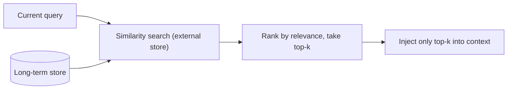

# Memory & state — recalling what matters across sessions

## Store everything, recall only what's relevant

Long-term memory is easy to write and easy to get wrong. The naive approach — dump the whole store
back into the context window at the start of each session — fails immediately: the store is far larger
than the window, and even if it fit, most of it is irrelevant to the task at hand. The right pattern
is **retrieve-then-inject**: keep everything in the external store, and at the moment of need pull in
only the **relevant** items, then add just those to the context.

Relevance is decided by a **relevance score** — typically semantic similarity between the current
query and each stored item (the same embedding search a vector store provides), optionally combined
with recency or importance. You **rank** the stored items by that score and take the top few. The
agent recalls by asking "what do I know that bears on *this*?" rather than "what do I know?".

## Why ranking matters

The reason relevance and ranking are not optional is that **irrelevant recall is actively harmful**,
not merely wasteful. Every item you inject costs context-window tokens, so stuffing in low-relevance
memories crowds out room for the actual task. Worse, off-topic recalled text **distracts** the model:
it will try to use what you put in front of it, and irrelevant memories pull its attention away from
the current goal or, at worst, mislead it.

So recall is a *ranking* problem, not a *retrieval* problem. Getting some semantically-nearby items
back is easy; the skill is scoring them so the **top-k most relevant** rise to the top and everything
else stays out of context. A recall system that returns items in insertion order, or returns
everything, has skipped the only part that makes long-term memory useful: deciding what *matters* for
this query and leaving the rest in the store.
