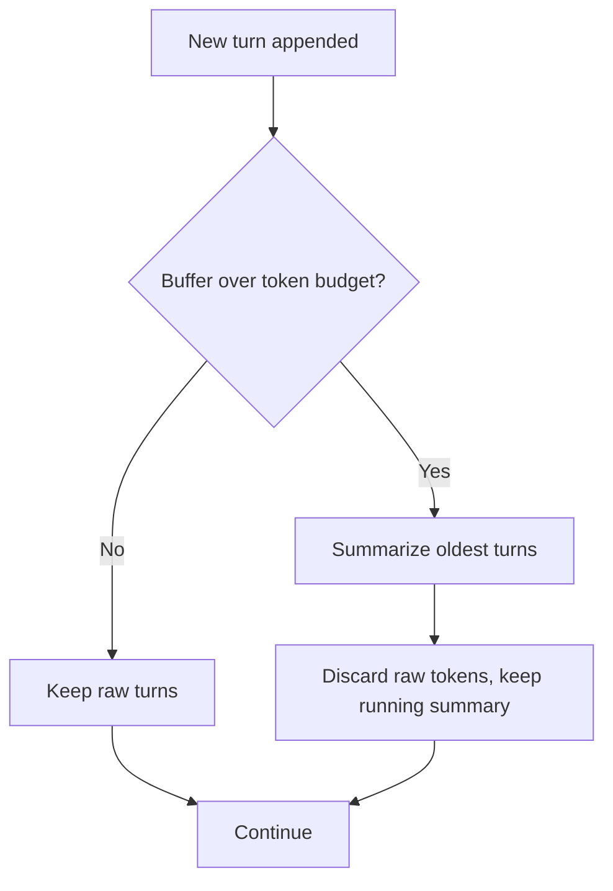

# Memory & state — compression roadmap

## Roadmap: compressing the context window

**What this section covers.** The short-term buffer cannot grow forever against a finite token
budget; this section is how compression collapses the oldest turns into a running summary — the
budget arithmetic that makes it correct, and the lossy risk that makes it dangerous.

**The ideas you'll meet:**

- **Token budget** — the hard cap on how much can sit in the context window at once.
- **Running summary** — a compact stand-in for the oldest turns, carried forward while their raw tokens are discarded.
- **Consolidation** — the right frame for compression: preserving state, not merely trimming length.
- **Budget threshold** — the trigger; you compress when the buffer would overflow, never on a fixed cadence.
- **Summary counts toward the budget** — the correctness condition: summary tokens + retained recent turns ≤ budget.
- **Lossy compression / silent forgetting** — dropped tokens are gone, so aggressive summarization causes subtle, hard-to-reproduce bugs.

**Why it matters.** Compression is what lets a long conversation keep going without blowing the
budget, but every dropped token is a fact you are betting you won't need — getting it wrong is where
some of the nastiest agent bugs hide.
