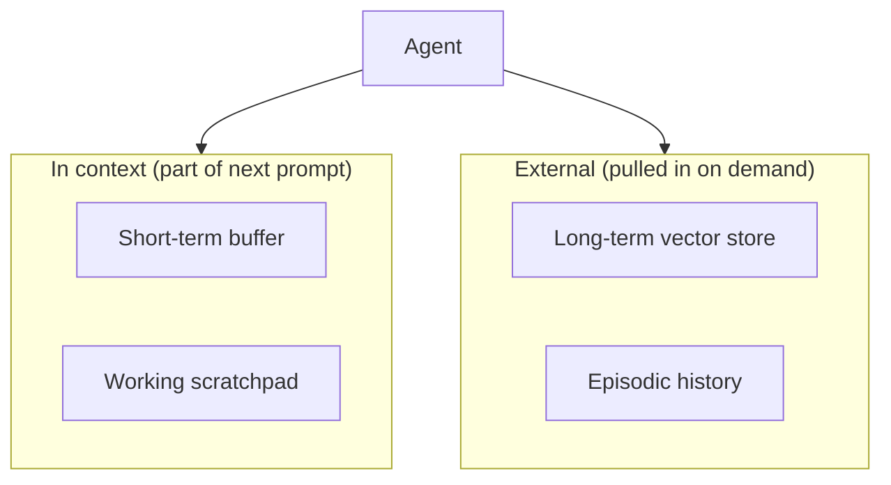

# Memory & state — the four memories roadmap

## Roadmap: the four memories

**What this section covers.** Why an agent needs memory at all, the four distinct memories every
agent keeps — and how to choose the right one for each piece of state instead of dumping everything
into the conversation.

**The ideas you'll meet:**

- **Short-term conversation buffer** — the most recent turns, held in context and capped to a fixed token budget.
- **Working state / scratchpad** — structured, task-specific state the agent reads and writes mid-task (plan, checklist, sub-goal).
- **Long-term vector store** — a durable external store queried by semantic similarity for recall across sessions.
- **Episodic history** — a durable, append-only log of past runs, queried by time or run id.
- **In-context vs external** — buffer and scratchpad ride in the prompt; store and log are pulled in on demand.
- **Lifetime & access pattern** — the two questions that decide where a piece of state belongs.
- **Staleness** — the standing risk of external memory: what you stored may no longer be true when you read it back.
- **MemGPT / virtual context management** — treating the context window as RAM and an external store as disk, paging memory between the two.

**Why it matters.** Keeping the four memories straight — recent talk, current task state, durable
semantic memory, and a run log — is the foundation the rest of the topic builds on; put state in the
wrong one and you have designed in a bug.
